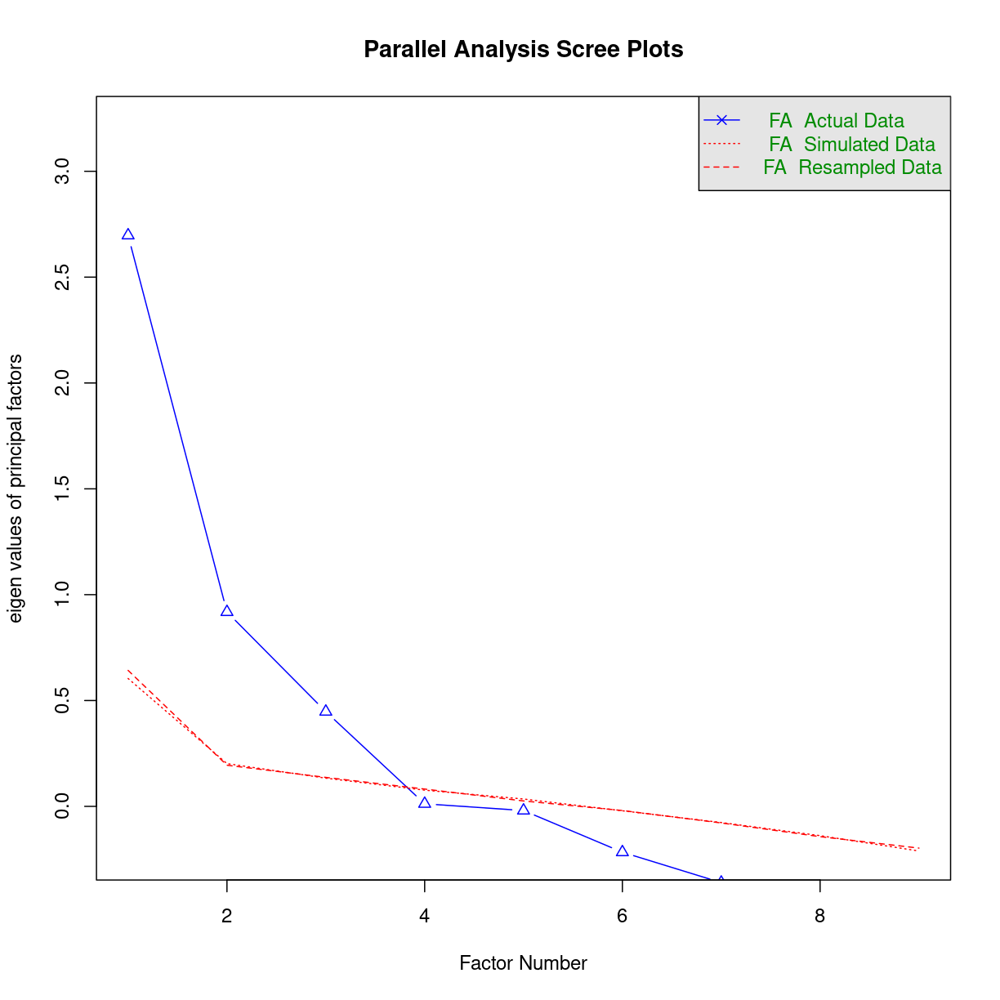

---
# Please do not edit this file directly; it is auto generated.
# Instead, please edit 04-efa_cfa.md in _episodes_rmd/
title: "Confirmatory Factor Analysis"
teaching: 0
exercises: 0
questions: 
- "FIXME"

objectives:
- "FIXME"

keypoints:
- "FIXME"
source: Rmd
---

## Hvad er Confirmatory Factor Analysis?

Vi har nogen observationer af ting. Hvor god er en skoleelev til at løse 
rumlige opgaver, forstå tekster og ord. Hvor hurtigt kan samme elev lægge tal 
sammen, tælle prikker på et stykke pair, og se forskel på forskellige bogstaver.

Vores tese er, at evnen til at forstå en sætning, gøre en sætning færdig, og 
vide hvad ord betyder, grundlæggende ikke er udtryk for tre forskellige 
færdigheder, men har en underliggende faktor, der beskriver en tekstuel
forståelse - måske intelligens i mangel af bedre ord.

Og at hastigheden hvormed der kan tælles prikker, lægges tal sammen og 
kendes forskel på bogstaver, heller ikke er udtryk for tre forskellige færdigheder,
men for en *anden* underliggende faktor, der beskriver hurtighed.

Tesen er, at hvis eleven scorer højt på den underliggende faktor, så scorer
eleven også højt på de tre variable, der er knyttet til denne underliggende 
faktor.

Vi vil med andre ord se, at de tre variable varierer sammen, og uafhængigt af
de andre variable.

I Confirmatory factor analysis, har vi opstillet en tese om hvor mange 
underliggende faktorer der er, og hvilke variable der forklares af disse 
faktorer. 

Ordene vi bruger, er at vi har manifeste variable - det er dem vi måler. 
Og latenten variable, det er dem vi forsøger at identificere.

Metoden er meget brugt i psykologien, hvorfra eksemplerne også stammer.

Til det bruger vi biblioteket lavaan, latent variable analysis.

~~~
library(lavaan) 
~~~
{: .language-r}

~~~
This is lavaan 0.6-14
lavaan is FREE software! Please report any bugs.
~~~
{: .output}

~~~
library(tidyverse)
library(psych)
~~~
{: .language-r}

~~~

Attaching package: 'psych'
~~~
{: .output}

~~~
The following object is masked from 'package:lavaan':

    cor2cov
~~~
{: .output}

~~~
The following objects are masked from 'package:ggplot2':

    %+%, alpha
~~~
{: .output}

## hvordan gør vi?

Et klassisk datasæt til formålet. Holzinger-Swineford. Kognitive tests af 
7. og 8. klasses elever fra to forskellige skoler. Som navnet antyder,
foretaget i 1939.

~~~
glimpse(HolzingerSwineford1939)
~~~
{: .language-r}

~~~
Rows: 301
Columns: 15
$ id     <int> 1, 2, 3, 4, 5, 6, 7, 8, 9, 11, 12, 13, 14, 15, 16, 17, 18, 19, …
$ sex    <int> 1, 2, 2, 1, 2, 2, 1, 2, 2, 2, 1, 1, 2, 2, 1, 2, 2, 1, 2, 2, 1, …
$ ageyr  <int> 13, 13, 13, 13, 12, 14, 12, 12, 13, 12, 12, 12, 12, 12, 12, 12,…
$ agemo  <int> 1, 7, 1, 2, 2, 1, 1, 2, 0, 5, 2, 11, 7, 8, 6, 1, 11, 5, 8, 3, 1…
$ school <fct> Pasteur, Pasteur, Pasteur, Pasteur, Pasteur, Pasteur, Pasteur, …
$ grade  <int> 7, 7, 7, 7, 7, 7, 7, 7, 7, 7, 7, 7, 7, 7, 7, 7, 7, 7, 7, 7, 7, …
$ x1     <dbl> 3.333333, 5.333333, 4.500000, 5.333333, 4.833333, 5.333333, 2.8…
$ x2     <dbl> 7.75, 5.25, 5.25, 7.75, 4.75, 5.00, 6.00, 6.25, 5.75, 5.25, 5.7…
$ x3     <dbl> 0.375, 2.125, 1.875, 3.000, 0.875, 2.250, 1.000, 1.875, 1.500, …
$ x4     <dbl> 2.333333, 1.666667, 1.000000, 2.666667, 2.666667, 1.000000, 3.3…
$ x5     <dbl> 5.75, 3.00, 1.75, 4.50, 4.00, 3.00, 6.00, 4.25, 5.75, 5.00, 3.5…
$ x6     <dbl> 1.2857143, 1.2857143, 0.4285714, 2.4285714, 2.5714286, 0.857142…
$ x7     <dbl> 3.391304, 3.782609, 3.260870, 3.000000, 3.695652, 4.347826, 4.6…
$ x8     <dbl> 5.75, 6.25, 3.90, 5.30, 6.30, 6.65, 6.20, 5.15, 4.65, 4.55, 5.7…
$ x9     <dbl> 6.361111, 7.916667, 4.416667, 4.861111, 5.916667, 7.500000, 4.8…
~~~
{: .output}

De unge mennesker blev testet på 9 parametre.

* x1 visuel opfattelse
* x2 noget med terninger
* x3 noget med lozenges
* x4 paragraph comprehension
* x5 sentence completion
* x6 word meaning
* x7 speeded addition
* x8 speeded counting of dots
* x9 speeded discrimination straight and curved capitals

Tesen er at der i deres test er en visuel faktor. x1, x2 og x3
en sproglig faktor, x4, x5 og x6
og en hurtighedsfaktor
x7, x8 og x9

vi opstiller en model, der ser lidt usædvanlig ud:

~~~
HS.model <- 'visual  =~ x1 + x2 + x3
             textual =~ x4 + x5 + x6
             speed   =~ x7 + x8 + x9'
~~~
{: .language-r}

Så fitter vi modellen på vores data:

~~~
fit <- cfa(HS.model, data = HolzingerSwineford1939)
~~~
{: .language-r}

Og ser hvordan fittet ser ud:

~~~
fit
~~~
{: .language-r}

~~~
lavaan 0.6.14 ended normally after 35 iterations

  Estimator                                         ML
  Optimization method                           NLMINB
  Number of model parameters                        21

  Number of observations                           301

Model Test User Model:
                                                      
  Test statistic                                85.306
  Degrees of freedom                                24
  P-value (Chi-square)                           0.000
~~~
{: .output}

Vupti, p-værdi på 0,000, alt er godt, vores model ser fin ud.

Hvis vi godt vil kigge nærmere på resultatet:

~~~
summary(fit, standardized=TRUE, fit.measures=TRUE, rsquare=TRUE)
~~~
{: .language-r}

~~~
lavaan 0.6.14 ended normally after 35 iterations

  Estimator                                         ML
  Optimization method                           NLMINB
  Number of model parameters                        21

  Number of observations                           301

Model Test User Model:
                                                      
  Test statistic                                85.306
  Degrees of freedom                                24
  P-value (Chi-square)                           0.000

Model Test Baseline Model:

  Test statistic                               918.852
  Degrees of freedom                                36
  P-value                                        0.000

User Model versus Baseline Model:

  Comparative Fit Index (CFI)                    0.931
  Tucker-Lewis Index (TLI)                       0.896

Loglikelihood and Information Criteria:

  Loglikelihood user model (H0)              -3737.745
  Loglikelihood unrestricted model (H1)      -3695.092
                                                      
  Akaike (AIC)                                7517.490
  Bayesian (BIC)                              7595.339
  Sample-size adjusted Bayesian (SABIC)       7528.739

Root Mean Square Error of Approximation:

  RMSEA                                          0.092
  90 Percent confidence interval - lower         0.071
  90 Percent confidence interval - upper         0.114
  P-value H_0: RMSEA <= 0.050                    0.001
  P-value H_0: RMSEA >= 0.080                    0.840

Standardized Root Mean Square Residual:

  SRMR                                           0.065

Parameter Estimates:

  Standard errors                             Standard
  Information                                 Expected
  Information saturated (h1) model          Structured

Latent Variables:
                   Estimate  Std.Err  z-value  P(>|z|)   Std.lv  Std.all
  visual =~                                                             
    x1                1.000                               0.900    0.772
    x2                0.554    0.100    5.554    0.000    0.498    0.424
    x3                0.729    0.109    6.685    0.000    0.656    0.581
  textual =~                                                            
    x4                1.000                               0.990    0.852
    x5                1.113    0.065   17.014    0.000    1.102    0.855
    x6                0.926    0.055   16.703    0.000    0.917    0.838
  speed =~                                                              
    x7                1.000                               0.619    0.570
    x8                1.180    0.165    7.152    0.000    0.731    0.723
    x9                1.082    0.151    7.155    0.000    0.670    0.665

Covariances:
                   Estimate  Std.Err  z-value  P(>|z|)   Std.lv  Std.all
  visual ~~                                                             
    textual           0.408    0.074    5.552    0.000    0.459    0.459
    speed             0.262    0.056    4.660    0.000    0.471    0.471
  textual ~~                                                            
    speed             0.173    0.049    3.518    0.000    0.283    0.283

Variances:
                   Estimate  Std.Err  z-value  P(>|z|)   Std.lv  Std.all
   .x1                0.549    0.114    4.833    0.000    0.549    0.404
   .x2                1.134    0.102   11.146    0.000    1.134    0.821
   .x3                0.844    0.091    9.317    0.000    0.844    0.662
   .x4                0.371    0.048    7.779    0.000    0.371    0.275
   .x5                0.446    0.058    7.642    0.000    0.446    0.269
   .x6                0.356    0.043    8.277    0.000    0.356    0.298
   .x7                0.799    0.081    9.823    0.000    0.799    0.676
   .x8                0.488    0.074    6.573    0.000    0.488    0.477
   .x9                0.566    0.071    8.003    0.000    0.566    0.558
    visual            0.809    0.145    5.564    0.000    1.000    1.000
    textual           0.979    0.112    8.737    0.000    1.000    1.000
    speed             0.384    0.086    4.451    0.000    1.000    1.000

R-Square:
                   Estimate
    x1                0.596
    x2                0.179
    x3                0.338
    x4                0.725
    x5                0.731
    x6                0.702
    x7                0.324
    x8                0.523
    x9                0.442
~~~
{: .output}

Vi kan se nærmere på covarianser

~~~
fitted(fit)
~~~
{: .language-r}

~~~
$cov
      x1    x2    x3    x4    x5    x6    x7    x8    x9
x1 1.358                                                
x2 0.448 1.382                                          
x3 0.590 0.327 1.275                                    
x4 0.408 0.226 0.298 1.351                              
x5 0.454 0.252 0.331 1.090 1.660                        
x6 0.378 0.209 0.276 0.907 1.010 1.196                  
x7 0.262 0.145 0.191 0.173 0.193 0.161 1.183            
x8 0.309 0.171 0.226 0.205 0.228 0.190 0.453 1.022      
x9 0.284 0.157 0.207 0.188 0.209 0.174 0.415 0.490 1.015
~~~
{: .output}
Koefficienter:

~~~
coef(fit)
~~~
{: .language-r}

~~~
      visual=~x2       visual=~x3      textual=~x5      textual=~x6 
           0.554            0.729            1.113            0.926 
       speed=~x8        speed=~x9           x1~~x1           x2~~x2 
           1.180            1.082            0.549            1.134 
          x3~~x3           x4~~x4           x5~~x5           x6~~x6 
           0.844            0.371            0.446            0.356 
          x7~~x7           x8~~x8           x9~~x9   visual~~visual 
           0.799            0.488            0.566            0.809 
textual~~textual     speed~~speed  visual~~textual    visual~~speed 
           0.979            0.384            0.408            0.262 
  textual~~speed 
           0.173 
~~~
{: .output}
Og residualerne:

~~~
resid(fit, type = "normalized")
~~~
{: .language-r}

~~~
$type
[1] "normalized"

$cov
       x1     x2     x3     x4     x5     x6     x7     x8     x9
x1  0.000                                                        
x2 -0.493  0.000                                                 
x3 -0.125  1.539  0.000                                          
x4  1.159 -0.214 -1.170  0.000                                   
x5 -0.153 -0.459 -2.606  0.070  0.000                            
x6  0.983  0.507 -0.436 -0.130  0.048  0.000                     
x7 -2.423 -3.273 -1.450  0.625 -0.617 -0.240  0.000              
x8 -0.655 -0.896 -0.200 -1.162 -0.624 -0.375  1.170  0.000       
x9  2.405  1.249  2.420  0.808  1.126  0.958 -0.625 -0.504  0.000
~~~
{: .output}
Vi kan også få et fint plot med vores fit. Der kan vi bruge pakken *semPlot*:

~~~
library(semPlot)
semPaths(fit, "std", layout = "tree", intercepts = F, residuals = T, nDigits = 2, 
         label.cex = 1, edge.label.cex=.95, fade = F)
~~~
{: .language-r}

## Men det er ikke første skridt.

Er vi stringente, bruger vi CFA til at bekræfte resultatet af en EFA (exploratory 
factor analysis) hvor ideen er at identificere de latente variable.

Vi kan godt komme med et kvalificeret bud i dette tilfælde. Især hvis vi på
forhånd ved at der skal være tre latente variable.

## Eksplorativ Faktor Analyse

Det er teknikken når vi skal identificere de latente faktorer.

Hvordan gør vi?

Funktionen hedder fa, for faktor analyse. Den kommer fra biblioteket *psych*:

~~~
hs.efa <- fa(select(HolzingerSwineford1939, x1:x9), nfactors = 8, 
             rotate = "none", fm = "ml")
hs.efa
~~~
{: .language-r}

~~~
Factor Analysis using method =  ml
Call: fa(r = select(HolzingerSwineford1939, x1:x9), nfactors = 8, rotate = "none", 
    fm = "ml")
Standardized loadings (pattern matrix) based upon correlation matrix
    ML1   ML2   ML4   ML3   ML5   ML6   ML7   ML8   h2    u2 com
x1 0.37  0.48  0.33 -0.21 -0.12 -0.18 -0.07 -0.09 0.58 0.420 3.9
x2 0.18  0.25  0.37 -0.17 -0.01  0.13  0.21  0.09 0.33 0.671 4.0
x3 0.14  0.51  0.39 -0.19 -0.03  0.22 -0.05 -0.07 0.52 0.480 2.9
x4 0.83  0.14 -0.24 -0.32 -0.13  0.00  0.03  0.01 0.88 0.123 1.6
x5 0.97 -0.12  0.05  0.11 -0.02  0.01  0.00  0.00 0.96 0.038 1.1
x6 0.80  0.13 -0.03 -0.21  0.34 -0.02 -0.02  0.02 0.82 0.182 1.6
x7 0.15  0.49 -0.42  0.35  0.01  0.11 -0.11 -0.03 0.59 0.406 3.3
x8 0.17  0.59 -0.09  0.43  0.07 -0.07  0.17 -0.06 0.62 0.384 2.4
x9 0.27  0.58  0.15  0.23 -0.09 -0.06 -0.08  0.19 0.54 0.456 2.3

                       ML1  ML2  ML4  ML3  ML5  ML6  ML7  ML8
SS loadings           2.56 1.54 0.66 0.63 0.17 0.12 0.10 0.06
Proportion Var        0.28 0.17 0.07 0.07 0.02 0.01 0.01 0.01
Cumulative Var        0.28 0.46 0.53 0.60 0.62 0.63 0.64 0.65
Proportion Explained  0.44 0.26 0.11 0.11 0.03 0.02 0.02 0.01
Cumulative Proportion 0.44 0.70 0.82 0.92 0.95 0.97 0.99 1.00

Mean item complexity =  2.6
Test of the hypothesis that 8 factors are sufficient.

The degrees of freedom for the null model are  36  and the objective function was  3.05 with Chi Square of  904.1
The degrees of freedom for the model are -8  and the objective function was  0 

The root mean square of the residuals (RMSR) is  0 
The df corrected root mean square of the residuals is  NA 

The harmonic number of observations is  301 with the empirical chi square  0  with prob <  NA 
The total number of observations was  301  with Likelihood Chi Square =  0  with prob <  NA 

Tucker Lewis Index of factoring reliability =  1.042
Fit based upon off diagonal values = 1
Measures of factor score adequacy             
                                                   ML1  ML2  ML4  ML3   ML5
Correlation of (regression) scores with factors   0.99 0.90 0.80 0.85  0.68
Multiple R square of scores with factors          0.97 0.80 0.65 0.72  0.47
Minimum correlation of possible factor scores     0.94 0.61 0.29 0.44 -0.07
                                                    ML6   ML7   ML8
Correlation of (regression) scores with factors    0.45  0.41  0.35
Multiple R square of scores with factors           0.20  0.17  0.12
Minimum correlation of possible factor scores     -0.60 -0.66 -0.75
~~~
{: .output}

Når vi skal finde ud af hvor mange latente variable der bør bruges er en af 
måderne at lave et screeplot:

~~~
plot(hs.efa$e.values)
~~~
{: .language-r}

Det giver os et bud på hvor meget forklaringskraft vores model har med forskellige
antal latente variable. Vi får rigtig meget ekstra forklaringskraft ved at 
gå fra en til to latente variable. En sjat mere med at gå fra to til tre, og 
endnu mere ved at gå fra tre til fire. Mens det at tilføje en femte latent
variabel ikke giver ret meget mere. 

Vi kan lave yderligere et plot:

~~~
fa.parallel(select(HolzingerSwineford1939, x1:x9), fa = "fa", fm = "ml")
~~~
{: .language-r}

~~~
Parallel analysis suggests that the number of factors =  3  and the number of components =  NA 
~~~
{: .output}
Her sammenligner vi vores data, som forklaret i modellen (blå linie) med 
simuleret, tilfældig data (røde linier). Det ser ud til at 3 faktorer ligger over
tilfældig støj. Tilføjer vi en fjerde latent variabel til modellen ligger
den ekstra forklaringskraft nede i støjen.

Så vi går efter tre latente variable.

Når vi så skal finde ud af hvilke manifeste variable der bør høre til hver af 
de tre latente variable, skal vi bruge en ekstra pakke:

~~~
library(GPArotation)
~~~
{: .language-r}

~~~
hs.efa3 <- fa(select(HolzingerSwineford1939, x1:x9), nfactors = 3, rotate = "oblimin", fm = "ml")

hs.efa3
~~~
{: .language-r}

~~~
Factor Analysis using method =  ml
Call: fa(r = select(HolzingerSwineford1939, x1:x9), nfactors = 3, rotate = "oblimin", 
    fm = "ml")
Standardized loadings (pattern matrix) based upon correlation matrix
     ML1   ML3   ML2   h2   u2 com
x1  0.19  0.60  0.03 0.49 0.51 1.2
x2  0.04  0.51 -0.12 0.25 0.75 1.1
x3 -0.07  0.69  0.02 0.46 0.54 1.0
x4  0.84  0.02  0.01 0.72 0.28 1.0
x5  0.89 -0.07  0.01 0.76 0.24 1.0
x6  0.81  0.08 -0.01 0.69 0.31 1.0
x7  0.04 -0.15  0.72 0.50 0.50 1.1
x8 -0.03  0.10  0.70 0.53 0.47 1.0
x9  0.03  0.37  0.46 0.46 0.54 1.9

                       ML1  ML3  ML2
SS loadings           2.24 1.34 1.28
Proportion Var        0.25 0.15 0.14
Cumulative Var        0.25 0.40 0.54
Proportion Explained  0.46 0.28 0.26
Cumulative Proportion 0.46 0.74 1.00

 With factor correlations of 
     ML1  ML3  ML2
ML1 1.00 0.33 0.22
ML3 0.33 1.00 0.27
ML2 0.22 0.27 1.00

Mean item complexity =  1.2
Test of the hypothesis that 3 factors are sufficient.

The degrees of freedom for the null model are  36  and the objective function was  3.05 with Chi Square of  904.1
The degrees of freedom for the model are 12  and the objective function was  0.08 

The root mean square of the residuals (RMSR) is  0.02 
The df corrected root mean square of the residuals is  0.03 

The harmonic number of observations is  301 with the empirical chi square  8.03  with prob <  0.78 
The total number of observations was  301  with Likelihood Chi Square =  22.38  with prob <  0.034 

Tucker Lewis Index of factoring reliability =  0.964
RMSEA index =  0.053  and the 90 % confidence intervals are  0.015 0.088
BIC =  -46.11
Fit based upon off diagonal values = 1
Measures of factor score adequacy             
                                                   ML1  ML3  ML2
Correlation of (regression) scores with factors   0.94 0.84 0.85
Multiple R square of scores with factors          0.89 0.71 0.72
Minimum correlation of possible factor scores     0.78 0.42 0.45
~~~
{: .output}

Her ser vi, at de manifeste variable: x1, x2 og x3, har høj loading for 
den latente faktor ML3. 

De manifeste variable x4, x5 og x6 har høj loading for den latente faktor ML1.

Og de manifeste variable x7, x8 og x9 har høj loading for den latente faktor ML2.

Det passer, ikke ganske tilfældigt, med den model vi opstillede under 
Confirmatory Factor Analysis afsnittet.

## Skal vi være stringente?

Det er folk sjældent. Men det bør vi. Det vi bør gøre, er at indsamle data,
lave vores eksplorative faktor analyse, og opstille modellen.

Herefter samler vi nyt data ind, og bruger det til at bekræfte vores model.

I praksis bruger folk samme datasæt til begge dele. Det er en diskussion værd
om det er god praksis, og vi bør fortælle de studerende at de snyder. 

Det gør alle andre også, så vi skal nok ikke fortælle dem at de ikke må, men at 
når de gør det som alle andre også burde lade være med, så skal de beskrive 
at de "snyder".
