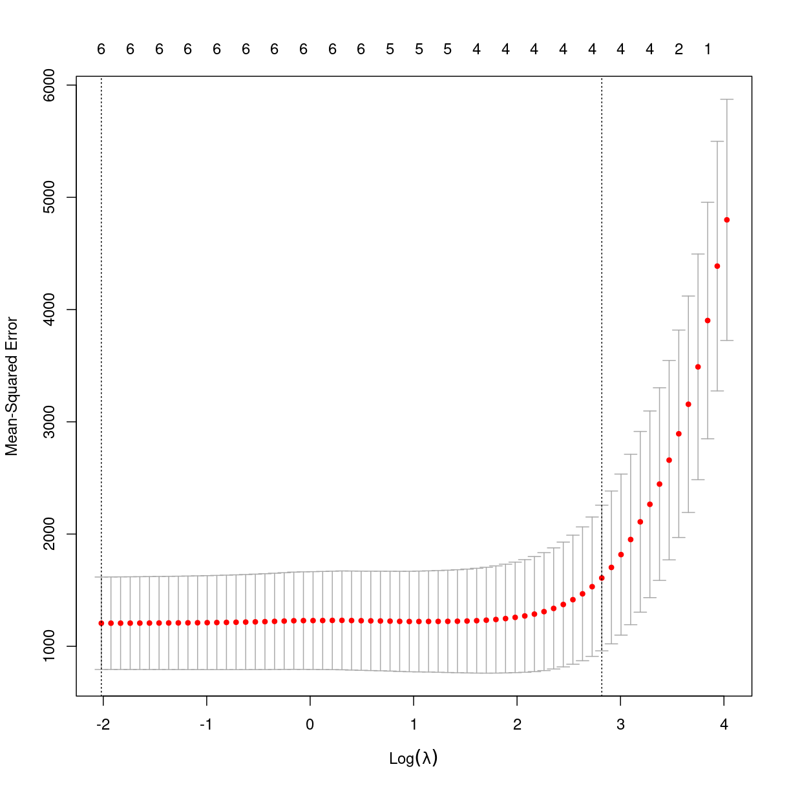

---
# Please do not edit this file directly; it is auto generated.
# Instead, please edit 05-lasso.md in _episodes_rmd/
title: "lasso"
teaching: 0
exercises: 0
questions: 
- "FIXME"

objectives:
- "FIXME"

keypoints:
- "FIXME"
source: Rmd
math: yes
---

Least Absolute Shrinkage and Selection Operator.

En regressions metode der gør to ting. Vælger variable, og foretager
regularisering.

Vi bruger den til at fitte regressionsmodeller når der er multicollinearitet i 
data.

Og hvad er det - jo, der er når der er to (eller flere) variable i data, der er 
stærkt korrellerede - og derfor ikke tilfører unik eller uafhængig information 
til modellen. 

Det kan gøre det vanskeligt at fitte og fortolke modellen.

Når vi fitter modeller, forsøger vi at finde koefficienter til modellen 

$$y = a_1*x_1 + a_2*x_2 + a_3*x_3 +....$$

Altså a_1, a_2, a_3 etc.

der minimerer forskellen på hvad vores model forudsiger og de "rigtige" data.

Det er typisk RSS (kvadrerede residualer).

\\(RSS = SUM(yi - ^y_i)^2\\)

I lasso, forsøger vi at minimere:

\(RSS + lambda * summen af beta_j\)

hvor j går fra 1 til p (antallet af variable vi har i vores model), og lambda
er større end eller lig 0.

Det svarer til at vi for hvert led i summen for rss, tilføjer et lambda*beta_j

Hvordan finder vi lambda? Vi vælger det der giver os mindst MSE.

Så vi beder en algoritme om at minimere udtrykket ovenfor - og det er lidt mere
komplekst.

Det vi fitter er nemlig ikke blot modellen, det er også:

$\sum_{i=1}^{n}(y_i - \sum_{j} x_{ij}\beta_j)^2 + \lambda\sum_{j=1}^p |\beta_j|$

x'erne er vores prediktive variable. y er hvad vi prøver at fitte - det er det
"sande" svar, det vi vil forudsige. Hvis vores model - det midterste sumtegn - 
rammer præcis, giver det præcist y, og y minus modellen giver så 0. 
Vi lægger så den absolutte værdi af vores koefficienter sammen, og ganger med 
lambda.

Vi skal finde den optimale værdi af lambda - og algoritmen vil lade nogle af 
prediktorerne (beta-værdierne) ende på 0, fordi det minimerer det samlede udtryk.

Det er en fiks måde algoritmisk at få pillet prediktorer ud, der ikke bidrager.

Hvordan gør man så?

Vi napper mtcars som eksempel. Vi skal nok have fundet et andet på et tidspunkt.

og så skal vi bruge pakker der implementerer løsningen - for vi gider ikke selv
skrive koden.

~~~
library(tidyverse)
library(glmnet)
~~~
{: .language-r}

~~~
Loading required package: Matrix
~~~
{: .output}

~~~

Attaching package: 'Matrix'
~~~
{: .output}

~~~
The following objects are masked from 'package:tidyr':

    expand, pack, unpack
~~~
{: .output}

~~~
Loaded glmnet 4.1-7
~~~
{: .output}

Implementeringen af lasso i glmnet, kræver at den afhængige variabel ligger i en
vektor, og at prediktor variablene ligger i en matrix.

Vi vil forudsige antallet af hestekræfter i en bil, baseret på mpg, wt, drat og
qsec

Og cyl, og disp - de er ikke med i hvad jeg i skrivende stund følger, men lad os prøve

~~~
y <- mtcars$hp
x <- mtcars %>% 
  select(mpg, wt, drat, qsec) %>% 
  data.matrix()
z <- data.matrix(mtcars[, c('mpg', 'wt', 'drat', 'qsec', 'cyl', 'disp')])
~~~
{: .language-r}

~~~
set.seed(2)
model <- cv.glmnet(z, y, alpha = 1)

best_l <- model$lambda.min
plot(model)
~~~
{: .language-r}

plot of chunk unnamed-chunk-4

Det er ganske mystisk at jeg ikke får samme optimale lambda som det eksempel
jeg følger. det er ok at der er små forskelle også mellem de enkelte kørsler 
der er et stokastisk element i krydsvalideringen.

men eksemplet finder lambda 5.616. Det er ret langt fra de 2-3 jeg finder.

Det skal der nok bores lidt i.

~~~
best_model <- glmnet(z,y,aplha = 1, lambda = best_l)
coef(best_model)
~~~
{: .language-r}

~~~
7 x 1 sparse Matrix of class "dgCMatrix"
                     s0
(Intercept) 315.5141283
mpg          -2.8386873
wt            7.4066930
drat         16.3768363
qsec        -14.8706337
cyl           5.9732285
disp          0.1470938
~~~
{: .output}
Hvilket får mig til at mene at jeg skal holde mig til
de oprindelige fire, og pille cyl og disp ud - for her er der ingen
parametre der pilles ud - og det er en lidt træls pointe at misse.

Det er nemlig også den primære forskel på lasso og ridge. Ridge regressionen 
kan indskrænke koefficienter mod 0, mens lasso kan indskrænke dem til 0. Og altså helt
fjerne det - det får vi ved at sætte alpha til 0.

Og så er der en elastic net regularisering der også kommer automatisk her - det er 
når vi sætter alpha til noget mellem 0 og 1.

~~~
best_model$beta
~~~
{: .language-r}

~~~
6 x 1 sparse Matrix of class "dgCMatrix"
              s0
mpg   -2.8386873
wt     7.4066930
drat  16.3768363
qsec -14.8706337
cyl    5.9732285
disp   0.1470938
~~~
{: .output}

~~~
summary(best_model)
~~~
{: .language-r}

~~~
          Length Class     Mode   
a0        1      -none-    numeric
beta      6      dgCMatrix S4     
df        1      -none-    numeric
dim       2      -none-    numeric
lambda    1      -none-    numeric
dev.ratio 1      -none-    numeric
nulldev   1      -none-    numeric
npasses   1      -none-    numeric
jerr      1      -none-    numeric
offset    1      -none-    logical
call      5      -none-    call   
nobs      1      -none-    numeric
~~~
{: .output}

