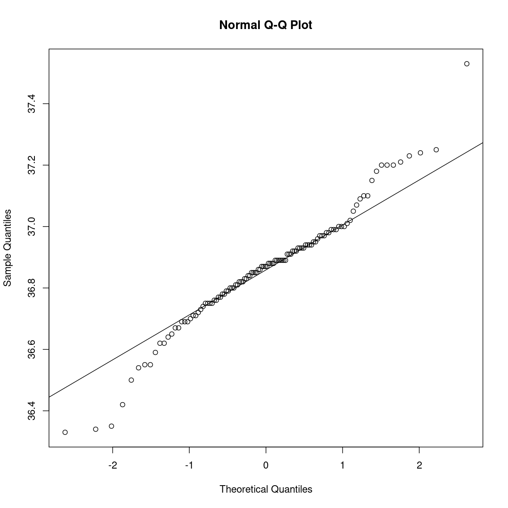

---
# Please do not edit this file directly; it is auto generated.
# Instead, please edit 06-fordeling_normal.md in _episodes_rmd/
title: "Normalfordelingen"
teaching: 0
exercises: 0
questions: 
- "Hvad pokker er den der normalfordeling egentlig?"
objectives:
- "Forstå normalfordelingen nok til at kunne hjælpe studerende"
keypoints:
- "FIXME"
source: Rmd
math: yes
---

# Hvad vil det sige at data er normaltfordelt

Mange statistiske tests forudsætter at data er normalfordelt.

Hvad vil det sige?

En normalfordeling er en sandsynlighedsfordeling. Eller på dansk noget der
fortæller os hvad sandsynligheden er for at observere noget bestemt.

Her er et eksempel, kropstemperaturen hos en bæver.

Hvis vi deler alle temperaturerne op i intervaller (36.2 til 36.6 grader, 36.7 til osv) 
og tæller hvor mange målinger vi har i hvert interval. Og derefter tegner en søjle
i hvert interval, hvis højde matcher antallet af observationer, får vi dette:

~~~
beaver1 %>% ggplot(aes(x=temp)) +
  geom_histogram(bins=25)
~~~
{: .language-r}

plot of chunk unnamed-chunk-1

Det ligner lidt den klokkekurve, som de fleste har set på et tidspunkt:

plot of chunk klokkekurven

Når vi taler om at noget data er normaltfordelt, så dækker det over at fordelingen
af data ligner normalfordelingen. Data behøver ikke være 100% fordelt på samme måde som
normalfordelingen, de skal bare være tæt nok på.

# Hvilke egenskaber har normalfordelingen?

En normalfordeling er ikke bare en normalfordeling. Men der er to parametre der
styrer hvordan den ser ud. En middelværdi, og en spredning. I kurven ovenfor,
er middelværdien, gennemsnittet, af observationerne 0, og spredningen, eller standardafvigelsen, 1.

Så man kan sagtens have en anden normalfordeling der ser anderledes ud, 
eksempelvis denne:

~~~
range(beaver1$temp)
~~~
{: .language-r}

~~~
[1] 36.33 37.53
~~~
{: .output}

~~~
data.frame(x = seq(35, 39,.01)) %>% 
  mutate(y = dnorm(x, mean = mean(beaver1$temp), sd = sd(beaver1$temp))) %>% 
  ggplot(aes(x,y)) +
  geom_path()
~~~
{: .language-r}

plot of chunk unnamed-chunk-2

Det er også en normalfordeling, den har gennemsnit på 36.86, og en standardafvigelse
på 0.193.

Det er, ikke helt tilfældigt, gennemsnittet og standardafvigelsen for bæverens 
kropstemperatur.

Hvad er det i øvrigt vi ser? 

Arealet under kurven er 1. Alle vores observationer er et sted i plottet. De har 
en given sandsynlighed. Når de alle er der, er summen af deres sandsynligheder
1.

Kigger vi på en bestemt værdi for observationerne, en bestemt legemstemperatur
for bævere, kan vi aflæse på kurven hvor sandsynlig den bestemte temperatur er.

Arealet under kurven til højre for den temperatur er sandsynligheden for at 
bævere har en legemstemperatur der er højere. Arealet under kurven til venstre
er sandsynligheden for at bævere har en legemstemperatur der er lavere.

Den øvelse kan vi foretage med alle værdier, og bestemme hvor stor en andel af
observationerne der bør ligge under i princippet alle forskellige værdier.

Vi ved med andre ord hvor stor en andel af observationerne der bør ligge over
og under en bestemt observation i det ideelle tilfælde, hvor data følger 
normalfordelingen perfekt. Og vi har vores data, og kan tælle os frem til hvor
mange der rent faktisk ligger over og under en bestemt værdi.

De to ting, idealet og virkeligheden, kan vi sammenligne. Hvis de er ensartede,
er data fra virkeligheden normalfordelte (eller tæt på). Hvis ikke, er de ikke
normalfordelte.

Hvis vi skal være helt stringente, er det sådan at blot fordi virkelighedens 
data ligner normalfordelingen til forveksling, så betyder det ikke nødvendigvis 
at de faktisk er normalfordelte.

Testen er typisk et qq-plot:

~~~
qqnorm(beaver1$temp)
qqline(beaver1$temp)
~~~
{: .language-r}

plot of chunk unnamed-chunk-3

Her får vi plottet, den rette linie, den fordeling vi burde se hvis data var
normalfordelte. Og, cirklerne, den fordeling vi ser i vores data.

Det er ikke en specielt overbevisende normalfordeling. Måske ikke overraskende.
Normalfordelingen vil fortælle os at der er en, godt nok meget lille, men 
dog positiv, sandsynlighed for at en bæver har en legemstemperatur på 500 grader
C. Og også en (meget lille, men dog) positiv sandsynlighed for at en bæver 
har en legemstemperatur på -50 grader. 
Ingen levende bævere har disse legemstemperaturer. Så vi har sådan set ingen
grund til for alvor at tro at bæveres temperatur faktisk er normalfordelt.

En del andre tests for normalfordelt data eksisterer. Og en del tests kan bruges
til formålet, selvom de egentlig ikke er bygget til det. Det kigger vi på et andet sted her på siden.
