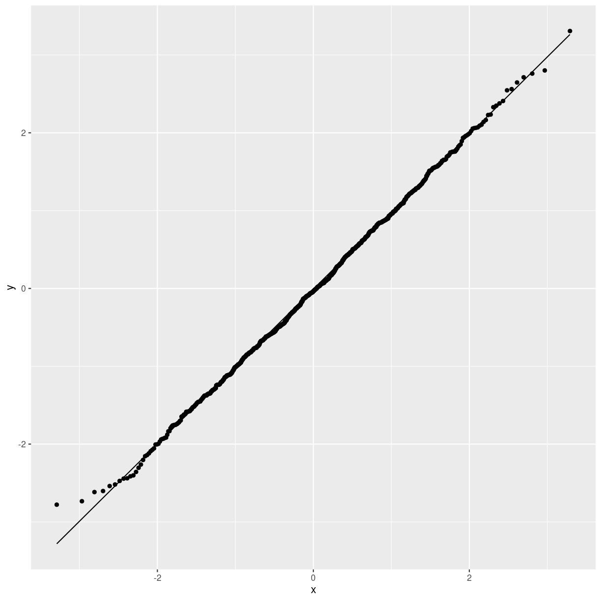

---
# Please do not edit this file directly; it is auto generated.
# Instead, please edit 07-normalfordelt.md in _episodes_rmd/
title: "Er mine data normalfordelte"
author: "Christian Knudsen"
date: "6/1/2022"
output: html_document
---

Mange statistiske tests forudsætter at data er normalfordelte. Men hvordan
finder man egentlig ud af om de er det?

Her er et datasæt. Det handler om hvordan tænder hos marsvin vokser, som funktion
af om de har fået C-vitaminer (VC) eller appelsinsaft (OJ). Og hvor meget de
har fået.

~~~
head(ToothGrowth)
~~~
{: .language-r}

~~~
   len supp dose
1  4.2   VC  0.5
2 11.5   VC  0.5
3  7.3   VC  0.5
4  5.8   VC  0.5
5  6.4   VC  0.5
6 10.0   VC  0.5
~~~
{: .output}

Er længden normalfordelt?

Først, hvad vil det sige at noget er normalfordelt?

~~~
data.frame(x = seq(-12,12,.1)) %>% 
  mutate(y = dnorm(x, mean = 5, sd = 1)) %>% 
  ggplot(aes(x,y)) +
  geom_point()
~~~
{: .language-r}

Dette er en normalfordeling. Den har middelværdien 5, og en standardafvigelse
på 1. Når vi vil vide hvad sandsynligheden for at se værdien 5, så finder vi 
5 på x-aksen, og aflæser værdien på y-aksen.

Det her er længden af tænderne på marsvinene. Her har vi optalt hvor mange 
tænder af en bestemt længde vi har observeret i forskellige intervaller.

~~~
ToothGrowth %>% 
  ggplot(aes(len)) +
  geom_histogram()
~~~
{: .language-r}

~~~
`stat_bin()` using `bins = 30`. Pick better value with `binwidth`.
~~~
{: .output}

Vi kunne dividere med antallet af observationer. Så ville vi få sandsynligheden 
for at observere en bestemt længde tand hos marsvinene.

Det ligner jo ikke specielt en normalfordeling. Men kan vi sige noget om hvor
tæt den er på?

En af egenskaberne ved normalfordelingen er, at 68,2% af observationerne skal
ligge centreret omkring middelværdien - indenfor intervallet +/- en 
standardafvigelse. 13,6% af observationerne skal ligge mellem middelværdien
plus standardafvigelsen, og middelværdien plus 2 gange standardafvigelsen.

Vi kan beregne ret præcist hvor stor en andel af observationerne der skal 
ligge i et hvilket som helst interval i normalfordelingen.

Tesen er, at hvis vores observerede data også har 68,2% af observationerne 
centreret omkring middelværdien og indenfor intervallet +/- 1 standardafvigelse.
og at 13,6% af observationerne mellem middelværdien plust 1 standardafvigelse og
middelværdien plus 2 standardafvigelser. Og i det hele taget har en andel af 
observationerne der matcher hvad normalfordelingen ville fortælle os - ja, så er
vores observationer normalfordelte. De fordeler sig på samme måde som normalfordelingen.

Det er der et standardplot der kan fortælle os om de gør. Det kaldes et QQ-plot.

Q'erne står for kvartiler. Det er vores intervaller fra før. Og selvom kvart i 
kvartil antyder at det er delt op i fire, så kan vi have 20 5% kvartiler også.
Vi beregner for enhver kvartil, hvor mange procent af
vores observationer der burde ligge der. Og så beregner vi hvor mange procent af
vores observationer der faktisk ligger der. Og det plotter vi.

~~~
ToothGrowth %>% 
  ggplot(aes(sample=len)) +
  geom_qq() +
  geom_qq_line()
~~~
{: .language-r}

Den rette linie er normalfordelingen. Og punkterne er vores observationer. 
Og det er ikke helt skævt.

Kan vi få sat tal på?

## Hvad er der af tests?

Det er fint at kunne plotte hvordan data ser ud. Men rarere at kunne få
sat tal på. Det er en øvelse som mange har puslet med, og derfor findes der
også mange tests der kan give os svar på spørgsmålet.

### Shapiro-Wilk

Denne test tester for normalitet på en lidt omvendt måde.

Se evt noter om p-værdier.

0-hypotesen er at data kommer fra en normal fordeling. Hvis p-værdien er tilstrækkelig
lav, afviser vi 0-hypotesen. Dette er med andre ord et tilfælde hvor vi 
ønsker at p-værdien skal være så høj som mulig. 

Litteraturen foreskriver at hvis p-værdien er mindre end 0.1, så er data
ihvertfald ikke normalfordelte.

~~~
shapiro.test(ToothGrowth$len)
~~~
{: .language-r}

~~~

	Shapiro-Wilk normality test

data:  ToothGrowth$len
W = 0.96743, p-value = 0.1091
~~~
{: .output}

p-værdien er >0.1, så vi kan ikke afvise 0-hypotesen om at data er normalfordelte.

### Kolmogorov-Smirnov

KS-testen fortæller os om vores data kommer fra en bestemt sandsynlighedsfordeling.

Det vil sige at den kan teste om vores data kommer fra en vilkårlig fordeling. 

Her er vi interesseret i om vores data kommer fra en normalfordelt population.

Den kan forstås som en test af hvor godt en normalfordeling med middelværdi
og standardafvigelse svarende til vores data, fitter, eller beskriver, vores data.

0-hypotesen er at data følger fordelingen. Hvis p > 0.05, afviser vi 0-hypotesen,
og konkluderer at vores data nok ikke er normalfordelte.

Så vi giver ks.test() vores data, ToothGrowth$len, og en normalfordeling med
middelværdi lig middelværdien for vores data, og standardafvigelse lig 
standardafvigelsen for vores data

~~~
ks.test(ToothGrowth$len, "pnorm", mean(ToothGrowth$len, sqrt(var(ToothGrowth$len))))
~~~
{: .language-r}

~~~
Warning in ks.test.default(ToothGrowth$len, "pnorm", mean(ToothGrowth$len, :
ties should not be present for the Kolmogorov-Smirnov test
~~~
{: .warning}

~~~

	Asymptotic one-sample Kolmogorov-Smirnov test

data:  ToothGrowth$len
D = 0.44108, p-value = 1.452e-10
alternative hypothesis: two-sided
~~~
{: .output}
Testen angives i litteraturen til at være ideel når vores datasæt er lille.

### Anderson-Darling test

Denne test svarer ligesom Kolmogorov-Smirnov også på om vores data stammer fra 
en given sandsynlighedsfordeling. I den implementering der ligger i nortest-biblioteket
testes der kun for normalitet.
Her som i Shapiro-Wilk skal man også være opmærksom på at 0-hypotesen er at 
data kommer fra en normalfordeling. 

~~~
library(nortest)
ad.test(ToothGrowth$len)
~~~
{: .language-r}

~~~

	Anderson-Darling normality test

data:  ToothGrowth$len
A = 0.64705, p-value = 0.08709
~~~
{: .output}
Når p>0.05 er vi derfor tilbøjelige til at konkludere at 0-hypotesen ikke kan 
afvises, og at data derfor er normalfordelte.

Den er i følge litteraturen ikke lige så god som Shapir-Wilk ( Razali, Nornadiah; Wah, Yap Bee (2011). "Power comparisons of Shapiro–Wilk, Kolmogorov–Smirnov, Lilliefors and Anderson–Darling tests". Journal of Statistical Modeling and Analytics. 2 (1): 21–33.)

### Cramer-Von Mises test

0-hypotesen er her at data kommer fra en normal fordeling.

~~~
library(goftest)
~~~
{: .language-r}

~~~

Attaching package: 'goftest'
~~~
{: .output}

~~~
The following objects are masked from 'package:nortest':

    ad.test, cvm.test
~~~
{: .output}

~~~
cvm.test(ToothGrowth$len, 'pnorm')
~~~
{: .language-r}

~~~

	Cramer-von Mises test of goodness-of-fit
	Null hypothesis: Normal distribution
	Parameters assumed to be fixed

data:  ToothGrowth$len
omega2 = 20, p-value < 2.2e-16
~~~
{: .output}
p-værdien er meget mindre end 0.05, og vi må derfor afvise 0-hypotesen. Data er
ikke normalfordelte.

skewness giver et indtryk af hvor skæv fordelingen er. den trækker måske for langt
til højre eller til venstre. En perfekt normalfordeling er ikke skewed.

kurtosis fortæller os om halerne på vores data er for fede eller for tynde
i forhold til hvad de burde være.

~~~
library(moments)
library(nortest)
library(e1071)
~~~
{: .language-r}

~~~

Attaching package: 'e1071'
~~~
{: .output}

~~~
The following objects are masked from 'package:moments':

    kurtosis, moment, skewness
~~~
{: .output}

~~~
ToothGrowth %>% 
  summarise(shapiro = shapiro.test(len)$p.value,
            skewness = skewness(len),
            kurtosis = kurtosis(ToothGrowth$len),
            ks_test = ks.test(len, "pnorm", mean(len, sqrt(var(len))))$p.value,
            ad_test = ad.test(ToothGrowth$len)$p.value
            )
~~~
{: .language-r}

~~~
Warning: There was 1 warning in `summarise()`.
ℹ In argument: `ks_test = ks.test(len, "pnorm", mean(len,
  sqrt(var(len))))$p.value`.
Caused by warning in `ks.test.default()`:
! ties should not be present for the Kolmogorov-Smirnov test
~~~
{: .warning}

~~~
    shapiro   skewness  kurtosis      ks_test ad_test
1 0.1091005 -0.1425376 -1.042514 1.452023e-10   1e-05
~~~
{: .output}

Man kan også beregne KL divergensen - det er der en separat note om

Histogram og Q-Q plot: Et histogram og en Q-Q plot (quantile-quantile plot) kan give et visuelt overblik over, om dine data er normalfordelte. Et histogram viser fordelingen af dine data i form af en barplot, mens en Q-Q plot viser en sammenligning af kvantiler i dine data med kvantiler i en normal fordeling. Hvis dine data ligner en normal fordeling, vil histogrammet se ud som en klokkeform, og Q-Q plot'en vil være en straight linje.

Kolmogorov-Smirnov test: Denne test sammenligner den empiriske kumulative fordelingsfunktion (ECDF) i dine data med den teoretiske kumulative fordelingsfunktion (CDF) for en normal fordeling. Hvis der er en god overensstemmelse mellem de to, kan det antages, at dine data er normalfordelte. Du kan bruge funktionen ks.test() i R til at lave denne test.

Anderson-Darling test: Denne test er lignende Kolmogorov-Smirnov testen, men den giver en mere præcis vurdering af, om dine data følger en normal fordeling. Du kan bruge funktionen ad.test() i R til at lave denne test.

Shapiro-Wilk test: Denne test sammenligner variancen i dine data med variancen i en normal fordeling. Hvis variancen i dine data er tæt på variancen i en normal fordeling, kan det antages, at dine data er normalfordelte. Du kan bruge funktionen shapiro.test() i R til at lave denne test.

Chi-kvadrat test: Denne test sammenligner antallet af observationer i dine data med antallet af observationer, der forventes i en normal fordeling. Hvis antallet af observationer i dine data er tæt på antallet af observationer, der forventes i en normal fordeling, kan det antages, at dine data er normalfordelte. Du kan bruge funktionen chisq.test() i R til at lave denne test.

Z-score test: Denne test beregner z-scores for hver observation i dine data, og sammenligner dem med z-scores for en normal fordeling. Hvis z-scores i dine data er tæt på z-scores i en normal fordeling, kan det antages, at dine data er normalfordelte. Du kan bruge funktionen scale() i R til at beregne z-scores.

Lilliefors test: Denne test er lignende Z-score testen, men den giver en mere præcis vurdering af, om dine data følger en normal fordeling. Du kan bruge funktionen lillie.test() i R til at lave denne test.

D'Agostino's K^2 test: Denne test sammenligner skewness og kurtosis i dine data med skewness og kurtosis i en normal fordeling. Hvis skewness og kurtosis i dine data er tæt på skewness og kurtosis i en normal fordeling, kan det antages, at dine data er normalfordelte. Du kan bruge funktionen dagostino.test() i R til at lave denne test.

Jarque-Bera test: Denne test er lignende D'Agostino's K^2 testen, men den giver en mere præcis vurdering af, om dine data følger en normal fordeling. Du kan bruge funktionen jarque.bera.test() i R til at lave denne test.

Anderson-Darling A^2 test: Denne test er lignende Anderson-Darling testen, men den giver en mere præcis vurdering af, om dine data følger en normal fordeling. Du kan bruge funktionen a2.test() i R til at lave denne test.
