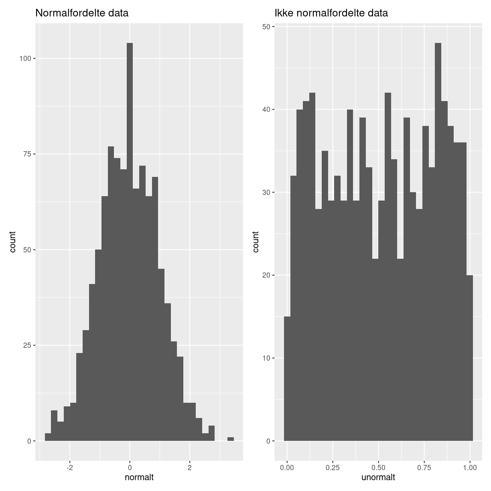
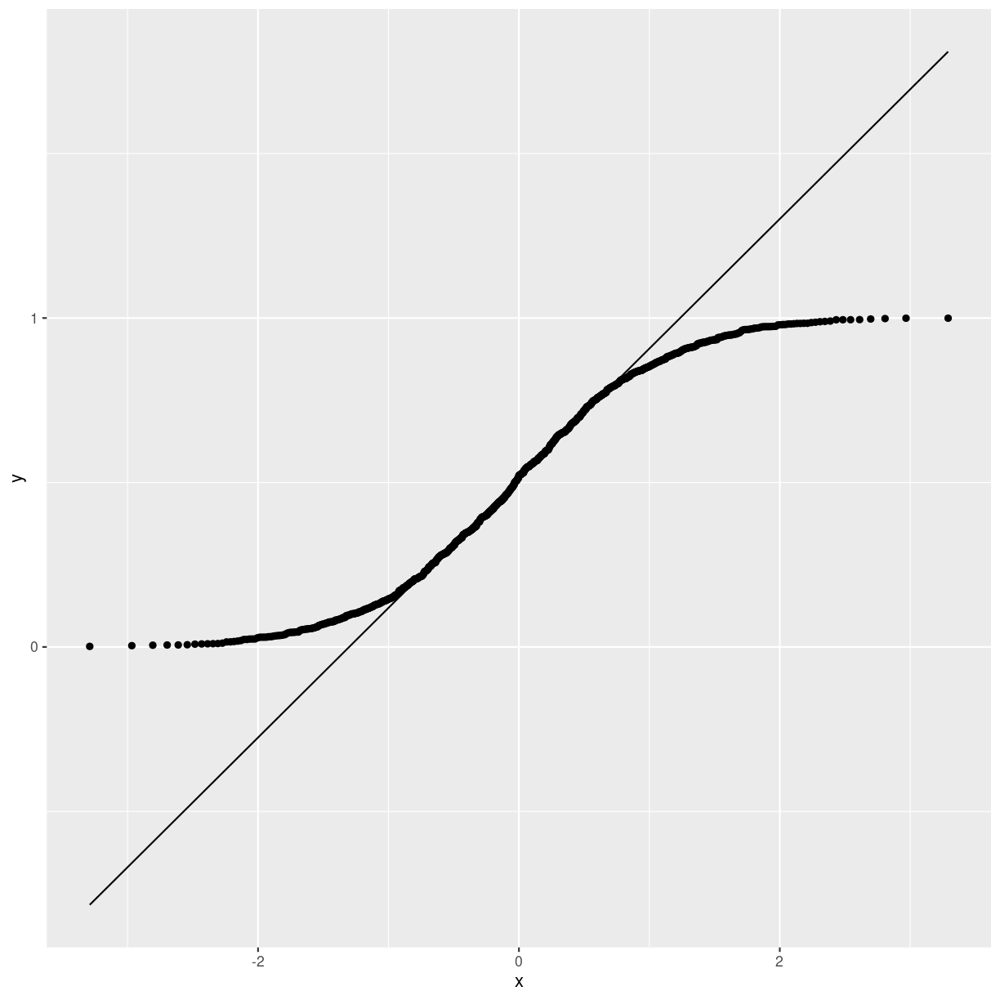

---
# Please do not edit this file directly; it is auto generated.
# Instead, please edit 07-normalfordelt.md in _episodes_rmd/
title: "Er mine data normalfordelte"
teaching: 0
exercises: 0
questions: 
- "Hvordan tester vi om data er normalfordelte"

objectives:
- "Vi skal kende tests der tester om data er normalfordelte"

keypoints:
- "Vær vågen - nogle tests giver små p-værdier når data er normalfordelte. Andre høje."
source: Rmd
math: yes
---

## TL;DR

Det første vi gør når vi forsøger at afgøre om data er normalfordelte er at lave et QQ-plot. 
Det næste er at få sat tal på hvor normalfordelte data er.
Det findes der tests der kan.

## Lidt længere

Mange statistiske tests forudsætter at data er normalfordelte. Men hvordan finder man egentlig ud af om de er det?

Der findes statistiske tests der kan afgøre det. De har det til fælles,
at de tester, eller giver et numerisk svar på spørgsmålet - hvor tætte er data på at komme fra en normalfordelt population. 

Eller, formuleret anderledes. Det vi gerne vil gøre med vores data, 
forudsætter at den population som vores data er en stikprøve af, er 
normalfordelt. Hvad er sandsynligheden for at data komer fra en normalfordelt population.

For at illustrere, laver vi to datasæt. Et der er normalfordelt, og et der ikke er.

~~~
normalt <- rnorm(1000)
unormalt <- runif(1000)
~~~
{: .language-r}

Det letter forståelsen af p-værdier når vi tester herunder.

Hvad vil det sige at noget er normalfordelt? Her er en normalfordeling:

~~~
data.frame(x = seq(-3,3,.1)) %>% 
  mutate(y = dnorm(x, mean = 0, sd = 1)) %>% 
  ggplot(aes(x,y)) +
  geom_point()
~~~
{: .language-r}

Dette er en normalfordeling. Den har middelværdien 0, og en standardafvigelse
på 1. Når vi vil vide hvad sandsynligheden for at se værdien 0, så finder vi 0 på x-aksen, og aflæser værdien på y-aksen.

Nu tager vi vores data. Der kan vi også finde sandsynligheden for at se 
en bestemt værdi. Den finder vi ved at tælle hvor mange gange den værdi optræder, og dividere med antallet af værdier i datasættet.

En af egenskaberne ved normalfordelingen er, at 68,2% af observationerne skal
ligge centreret omkring middelværdien - indenfor intervallet +/- en 
standardafvigelse. 
Ikke alene det, vi kan beregne ret præcist hvor stor en andel af observationerne der skal ligge i et hvilket som helst interval i normalfordelingen.

Tesen er, at hvis vores observerede data også har 68,2% af observationerne centreret omkring middelværdien og indenfor intervallet +/- 1 standardafvigelse. Og i øvrigt også en andel af observationer i forskellige intervaller der matcher hvad der ville være gældende for
normalfordelingen - ja, så er vores observerede data også normalfordelte.

Tricket er så let og hurtigt at få beregnet hvordan vores data fordeler sig, og sammenligne med normalfordelingen.

Det er der et standardplot der kan fortælle os om de gør. Det kaldes et QQ-plot.

Q'erne står for kvartiler. Det er vores intervaller fra før. Og selvom kvart i 
kvartil antyder at det er delt op i fire, så kan vi have 20 5% kvartiler også.
Vi beregner for enhver kvartil, hvor mange procent af
vores observationer der burde ligge der. Og så beregner vi hvor mange procent af
vores observationer der faktisk ligger der. Og det plotter vi.

~~~
tibble(normalt) %>% 
  ggplot(aes(sample=normalt)) +
  geom_qq() +
  geom_qq_line()
~~~
{: .language-r}

Den rette linie er normalfordelingen. Og punkterne er vores observationer. Og det er ikke helt skævt. Det skal det heller ikke være. Data er konstruerede til at være normalfordelte.

De unormale data derimod ligger ikke så pænt:

~~~
tibble(unormalt) %>% 
  ggplot(aes(sample=unormalt)) +
  geom_qq() +
  geom_qq_line()
~~~
{: .language-r}

## Hvad er der af tests?

Det er fint at kunne plotte hvordan data ser ud. Men rarere at kunne få
sat tal på. Det er en øvelse som mange har puslet med, og derfor findes der
også mange tests der kan give os svar på spørgsmålet.

Se evt noter om p-værdier.

### Shapiro-Wilk

Denne test opstiller en 0-hypotese der siger at data kommer fra en
normalfordeling. Hvis p-værdien er tilstrækkelig lav, afviser vi
0-hypotesen. 

Litteraturen foreskriver at hvis p-værdien er mindre end 0.1, så er data
ihvertfald ikke normalfordelte.

Sådan ser resultatet ud for normalfordelte data:

~~~
shapiro.test(normalt)
~~~
{: .language-r}

~~~

	Shapiro-Wilk normality test

data:  normalt
W = 0.99922, p-value = 0.9602
~~~
{: .output}
p-værdien er >0.1, så vi kan ikke afvise 0-hypotesen om at data er normalfordelte.

For unormale data:

~~~
shapiro.test(unormalt)
~~~
{: .language-r}

~~~

	Shapiro-Wilk normality test

data:  unormalt
W = 0.95509, p-value < 2.2e-16
~~~
{: .output}
Meget lav p-værdi. Så vi afviser 0-hypotesen om at data er normalfordelte.

### Kolmogorov-Smirnov

KS-testen fortæller os om vores data kommer fra en bestemt sandsynlighedsfordeling.

Det vil sige at den kan teste om vores data kommer fra en vilkårlig fordeling. Her er vi interesseret i om vores data kommer fra en normalfordelt population, med samme middelværdi og standardafvigelse som vores data.

0-hypotesen er at vores data følger fordelingen. Hvis p > 0.05, afviser vi 0-hypotesen, og konkluderer at vores data nok ikke er normalfordelte.

Testen angives i litteraturen til at være ideel når vores datasæt er lille.

Her er resultatet for vores normalfordelte data:

~~~
ks.test(normalt, "pnorm", mean(normalt, sd(normalt)))
~~~
{: .language-r}

~~~

	Asymptotic one-sample Kolmogorov-Smirnov test

data:  normalt
D = 0.013553, p-value = 0.9929
alternative hypothesis: two-sided
~~~
{: .output}
p-værdien er meget større end 0.05, og vi kan derfor ikke afvise 
0-hypotesen om at vores data er normalfordelte.

Med data der ikke er normaltfordelte:

~~~
ks.test(unormalt, "pnorm", mean(unormalt, sd(unormalt)))
~~~
{: .language-r}

~~~

	Asymptotic one-sample Kolmogorov-Smirnov test

data:  unormalt
D = 0.30888, p-value < 2.2e-16
alternative hypothesis: two-sided
~~~
{: .output}
Her er p-værdien meget lille, og vi kan derfor afvise 0-hypotesen om at
vores data er normalfordelte.

### Anderson-Darling test

Denne test svarer ligesom Kolmogorov-Smirnov også på om vores data stammer fra 
en given sandsynlighedsfordeling. I den implementering der ligger i nortest-biblioteket testes der kun for normalitet.

Her er 0-hypotesen også at vores data kommer fra en normalfordeling.

~~~
library(nortest)
ad.test(normalt)
~~~
{: .language-r}

~~~

	Anderson-Darling normality test

data:  normalt
A = 0.14673, p-value = 0.9669
~~~
{: .output}
p-værdien er større end 0.05, og vi konkluderer derfor at 0-hypotesen ikke kan afvises, og at vores data derfor er normalfordelte.

De ikke normalfordelte data giver dette resultat:

~~~
ad.test(unormalt)
~~~
{: .language-r}

~~~

	Anderson-Darling normality test

data:  unormalt
A = 10.715, p-value < 2.2e-16
~~~
{: .output}
Her er p-værdien meget lille, og vi afviser derfor 0-hypotesen om at data er normalfordelte. 

Den er i følge litteraturen ikke lige så god som Shapiro-Wilk ( Razali, Nornadiah; Wah, Yap Bee (2011). "Power comparisons of Shapiro–Wilk, Kolmogorov–Smirnov, Lilliefors and Anderson–Darling tests". Journal of Statistical Modeling and Analytics. 2 (1): 21–33.)

### Cramer-Von Mises test

0-hypotesen er her at data kommer fra en bestemt fordeling.

Funktionen kommer fra biblioteket `goftest`. Vi skal angive at den fordeling vi ønsker at sammenligne med er normalfordelingen; det vil sige at vi også kan teste om vores data følger en anden fordeling.

Først vores normaltfordelte data:

~~~
library(goftest)
~~~
{: .language-r}

~~~

Attaching package: 'goftest'
~~~
{: .output}

~~~
The following objects are masked from 'package:nortest':

    ad.test, cvm.test
~~~
{: .output}

~~~
cvm.test(normalt, 'pnorm')
~~~
{: .language-r}

~~~

	Cramer-von Mises test of goodness-of-fit
	Null hypothesis: Normal distribution
	Parameters assumed to be fixed

data:  normalt
omega2 = 0.028725, p-value = 0.9802
~~~
{: .output}
p-værdien er meget højere end 0.05, og vi kan derfor ikke afvise 0-hypotesen om at data er normalfordelte.

De ikke normaltfordelte data:

~~~
cvm.test(unormalt, 'pnorm')
~~~
{: .language-r}

~~~

	Cramer-von Mises test of goodness-of-fit
	Null hypothesis: Normal distribution
	Parameters assumed to be fixed

data:  unormalt
omega2 = 69.923, p-value < 2.2e-16
~~~
{: .output}
Her er p-værdien meget mindre end 0.05, og vi afviser derfor 0-hypotesen om at data er normalfordelte.

### Lilliefors

Normaltfordelte data:

~~~
library(nortest)
lillie.test(normalt)
~~~
{: .language-r}

~~~

	Lilliefors (Kolmogorov-Smirnov) normality test

data:  normalt
D = 0.012763, p-value = 0.958
~~~
{: .output}
Ikke-normaltfordelte data:

~~~
lillie.test(unormalt)
~~~
{: .language-r}

~~~

	Lilliefors (Kolmogorov-Smirnov) normality test

data:  unormalt
D = 0.063196, p-value = 4.305e-10
~~~
{: .output}
Lilliefors testen er en variant over Kolmogorov-Smirnov-testen, der 
korrigerer for små værdier i sandsynlighedsfordelingernes haler.

Den kan også bruges i stedet for K-S testen når du ikke kender
middelværdien eller standardafvigelsen af din population.

