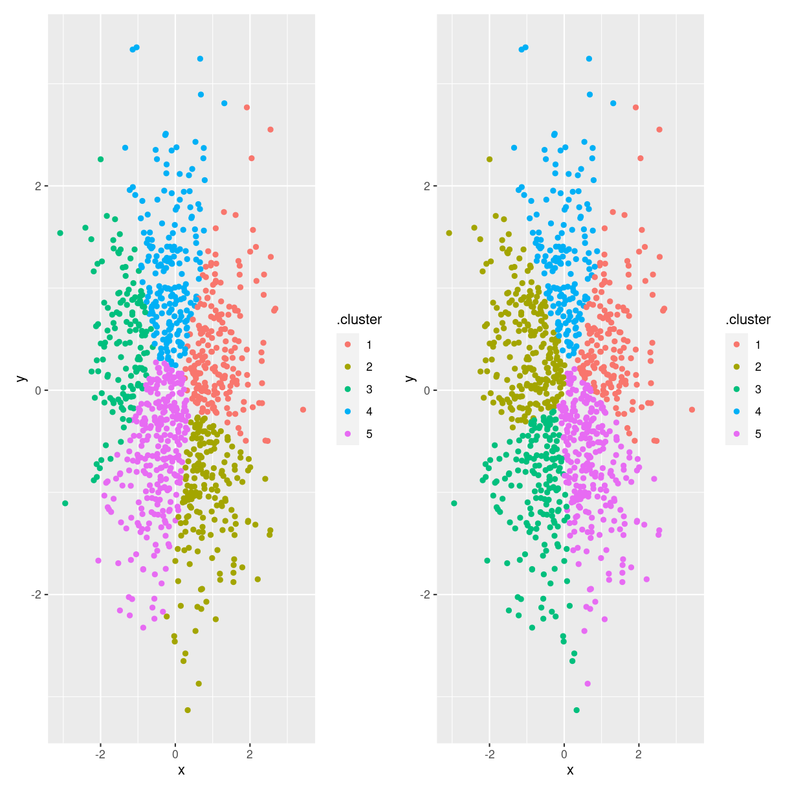

---
# Please do not edit this file directly; it is auto generated.
# Instead, please edit 09-kmeans.md in _episodes_rmd/
title: "Kmeans"
teaching: 0
exercises: 0
questions: 
- "FIXME"

objectives:
- "FIXME"

keypoints:
- "FIXME"
source: Rmd
math: yes
---

vil kmeans altid give samme resultat?
Nej.

Her er 1000 helt tilfældige pupnkter:

~~~
test_data <- data.frame(x = rnorm(1000), y = rnorm(1000))
~~~
{: .language-r}

Der er ingenstruktur i de data. Eller, hvis der er, er der noget galt med
tilfældighedsgeneratoren.

Men kmeans kan finde det antal clustre vi beder den om, uanset om der er struktur
eller ej.

Lad os finde 5 clustre. Vi starter med at låse tilfældighedsgeneratoren, 
så vi får samme resultat når vi gør det samme i morgen

~~~
set.seed(42)
kmeans_model1 <- kmeans(test_data, 5)
cluster1 <- augment(kmeans_model1, test_data)
~~~
{: .language-r}

Lad os gøre det igen:

~~~
kmeans_model2 <- kmeans(test_data, 5)
cluster2 <- augment(kmeans_model2, test_data)
~~~
{: .language-r}

Hvis kmeans gav samme resultat hver gang, ville 

~~~
sum(cluster2$.cluster != cluster1$.cluster)
~~~
{: .language-r}

~~~
[1] 610
~~~
{: .output}
være lig 0. Det er det ikke.

Lad os prøve at plotte:

~~~
første <- ggplot(cluster1, aes(x,y, color = .cluster)) +
  geom_point()

anden <- ggplot(cluster2, aes(x,y,color=.cluster)) +
  geom_point()

første + anden
~~~
{: .language-r}

