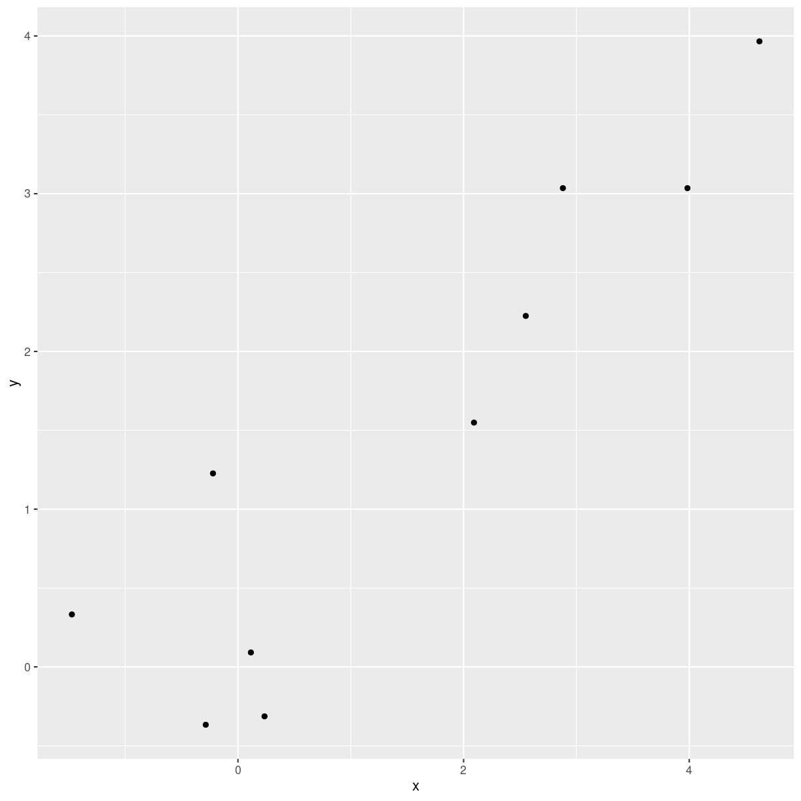
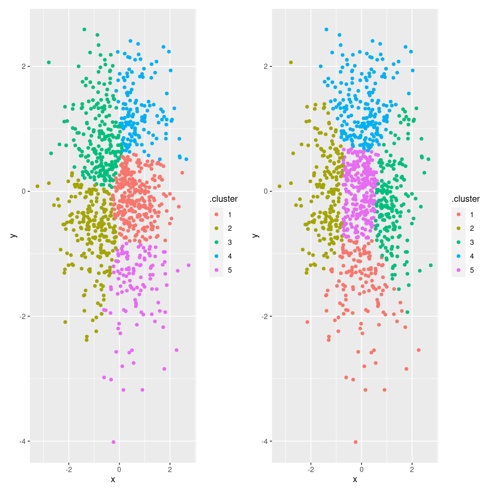

---
# Please do not edit this file directly; it is auto generated.
# Instead, please edit 09-kmeans.md in _episodes_rmd/
title: "Kmeans"
teaching: 0
exercises: 0
questions: 
- "Hvad er k-means?"
objectives:
- "FIXME"
keypoints:
- "FIXME"
source: Rmd
math: yes
---

## TL;DR

k-means er en maskinlæringsalgoritme, der klassificerer data i k-klasser.

Den er baseret på numeriske værdier, det kunne se således ud:

~~~
test_data <- rbind(
  data.frame(x = rnorm(5, 0,1), y = rnorm(5,0,1)),
  data.frame(x = rnorm(5, 3,1), y = rnorm(5,3,1)))
test_data
~~~
{: .language-r}

~~~
            x          y
1  -0.5834970  0.1714926
2  -1.3935274  1.3844773
3   2.2744174 -1.7321887
4  -0.3770047 -0.4724175
5  -1.3122469  0.5550489
6   2.6721631  2.4761828
7   3.9023787  3.1805996
8   3.7208689  2.3449883
9   5.9237508  3.5394064
10  3.5549863  4.0664829
~~~
{: .output}
Plotter vi dem er det tydeligt at der er struktur i data:

~~~
ggplot(test_data, aes(x,y)) +
  geom_point()
~~~
{: .language-r}

Kan vi få computeren til at identificere den struktur?

Ja:

~~~
kmeans(test_data, 2)
~~~
{: .language-r}

~~~
K-means clustering with 2 clusters of sizes 5, 5

Cluster means:
           x           y
1  3.9548296  3.12153200
2 -0.2783717 -0.01871747

Clustering vector:
 [1] 2 2 2 2 2 1 1 1 1 1

Within cluster sum of squares by cluster:
[1]  7.829784 14.408203
 (between_SS / total_SS =  75.7 %)

Available components:

[1] "cluster"      "centers"      "totss"        "withinss"     "tot.withinss"
[6] "betweenss"    "size"         "iter"         "ifault"      
~~~
{: .output}
## Hvad sker der?

k-means er en unsupervised maskinlæringsmodel. Den finder med andre
ord struktur i vores data, uden at vi skal træne den på noget kendt struktur.

Algoritmen laver k tilfældige punkter i vores data. Dem kalder vi for
centroider. De har samme dimensioner som vores data, der altså her er 2, x og y. Men der er ikke nogen øvre grænse for hvor mange dimensioner data kan have.

Nu beregner algoritmen hvilken af centroiderne observationerne i data ligger tættest på. 

Når den har gjort det, tildeler den hvert af punkterne en "klasse", der matcher en centroide. Her har vi valgt at der skal være to klasser, hvert datapunkt får derfor enten klassen 1 eller 2.

Dernæst samler algoritmen alle punkterne i klasse 1, og beregner en ny centroide, som gennemsnittet af punkterne i klasse 1. Den gør det samme med klasse 2. Er der flere gør den det med alle klasser.

Algoritmen har nu opdaterede centroider. Den beregner så hvilken af de nye centroider observationerne i data ligger tættest på, og opdaterer
tildelingen af klasser til punkter. 

Nu kan der beregnes nye centroider igen. Processen fortsætter indtil algoritmen enten har gjort det så mange gange som vi måtte have specificeret (default 1000 gange), eller inddtil der ikke er data der "hopper" fra en klasse til en anden længere. 

Nu er algoritmen færdig, og den har klassificeret data i k klasser.

## vil kmeans altid give samme resultat?

Nej.

Her er 1000 helt tilfældige pupnkter:

~~~
test_data <- data.frame(x = rnorm(1000), y = rnorm(1000))
~~~
{: .language-r}

Der er ingen struktur i de data. Eller, hvis der er, er der noget galt med tilfældighedsgeneratoren.

Men kmeans kan finde det antal clustre vi beder den om, uanset om der er struktur eller ej.

Lad os finde 5 clustre. Vi starter med at låse tilfældighedsgeneratoren, 
så vi får samme resultat når vi gør det samme i morgen. `augment` funktionen tager vores data, og tildeler det klasser baseret på kmeans resultatet:

~~~
set.seed(42)
kmeans_model1 <- kmeans(test_data, 5)
cluster1 <- augment(kmeans_model1, test_data)
~~~
{: .language-r}

Lad os gøre det igen:

~~~
kmeans_model2 <- kmeans(test_data, 5)
cluster2 <- augment(kmeans_model2, test_data)
~~~
{: .language-r}

Hvis kmeans gav samme resultat hver gang, ville cluster1 og cluster2 være ens.

~~~
sum(cluster2$.cluster != cluster1$.cluster)
~~~
{: .language-r}

~~~
[1] 960
~~~
{: .output}
Hvis de var det, ville ovenstående resultat være 0. Det er det ikke.

Vi kan også visualisere at data klassificeres forskelligt:

~~~
første <- ggplot(cluster1, aes(x,y, color = .cluster)) +
  geom_point()

anden <- ggplot(cluster2, aes(x,y,color=.cluster)) +
  geom_point()

første + anden
~~~
{: .language-r}

k-means algoritmen er følsom overfor de tilfældige centroider der vælges i starten af den. Den bør dog, hvis der faktisk er struktur i data, 
give ca. samme resultat.

Der er data med tydelig struktur, hvor kmeans ikke kan finde den:

Her er der tydelig struktur. En klasse ligger inde omkring 0,0, en anden klasse ligger rundt om, med pæn afstand til den første klasse.

Når vi træner en k-means model på det data, får vi ikke helt det vi forventer:

~~~
kmeans_model3 <- kmeans(test_data[,-3], 2)
cluster3 <- augment(kmeans_model3, test_data[,-3])
~~~
{: .language-r}

~~~
ggplot(cluster3, aes(x,y,color=.cluster)) +
  geom_point()
~~~
{: .language-r}

