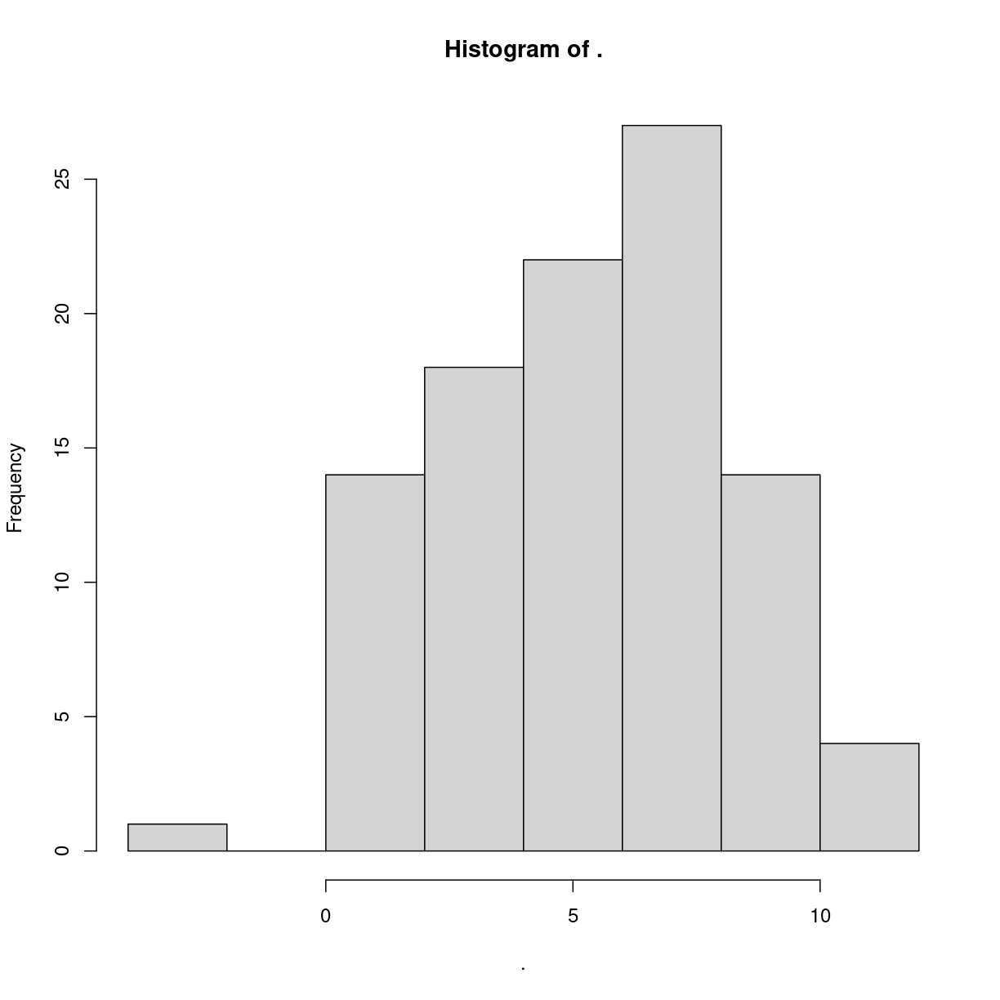
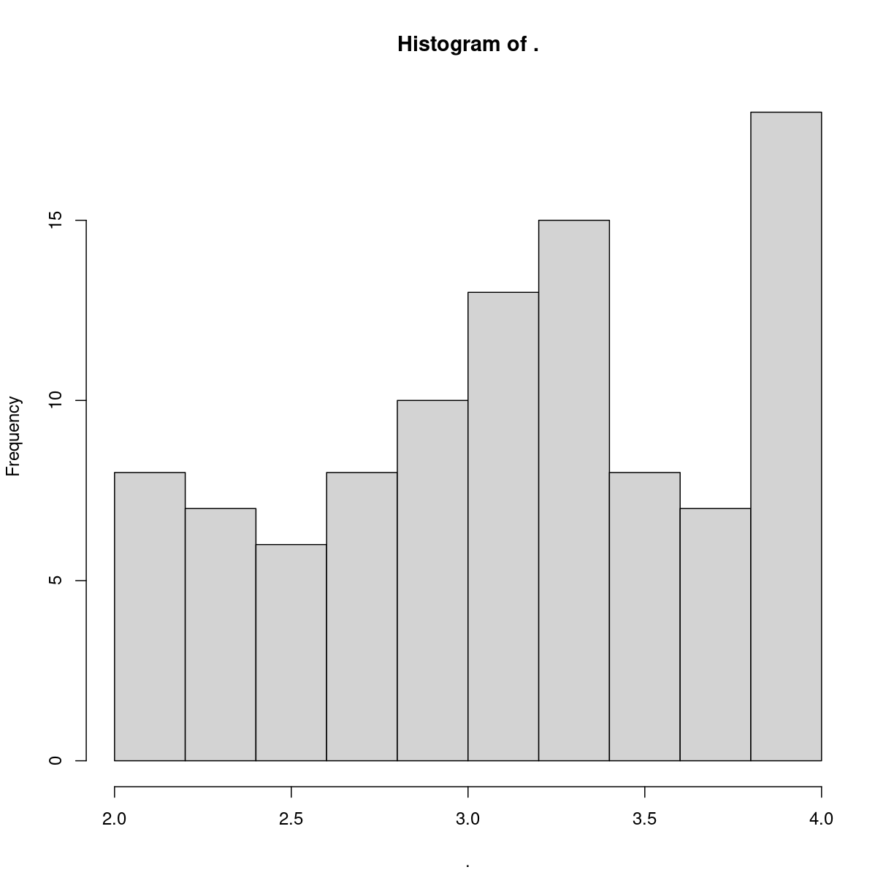

---
# Please do not edit this file directly; it is auto generated.
# Instead, please edit 11-lineær-regression.md in _episodes_rmd/
title: "Lineær regression"
teaching: 0
exercises: 0
questions: 
- "FIXME"

objectives:
- "FIXME"

keypoints:
- "FIXME"
- "Accuracy"
- "Precision"
- "Recall"
- "Sensitivitet"
- "Specificitet"
source: Rmd
math: yes
---

~~~
set.seed(3)
n <- 500
covariate <- runif(n, -10, 10)
y <- rnorm(n, 1+2*covariate, 5)

shapiro.test(y)
~~~
{: .language-r}

~~~

	Shapiro-Wilk normality test

data:  y
W = 0.98609, p-value = 0.0001039
~~~
{: .output}

~~~
m1 <- lm(y ~covariate)
m_resid <- resid(m1)
shapiro.test(m_resid)
~~~
{: .language-r}

~~~

	Shapiro-Wilk normality test

data:  m_resid
W = 0.99766, p-value = 0.7167
~~~
{: .output}

~~~
library(tidyverse)
shapiro.test(rnorm(100, mean = 5, sd = 3))
~~~
{: .language-r}

~~~

	Shapiro-Wilk normality test

data:  rnorm(100, mean = 5, sd = 3)
W = 0.99033, p-value = 0.6913
~~~
{: .output}

~~~
rnorm(100, mean = 5, sd = 3) %>% hist()
~~~
{: .language-r}

plot of chunk unnamed-chunk-3

~~~
shapiro.test(runif(100, min = 2, max = 4)) 
~~~
{: .language-r}

~~~

	Shapiro-Wilk normality test

data:  runif(100, min = 2, max = 4)
W = 0.93943, p-value = 0.0001779
~~~
{: .output}

~~~
runif(100, min = 2, max = 4)%>% hist()
~~~
{: .language-r}

plot of chunk unnamed-chunk-3

## Skal det være normalfordelt? 

Nej, det forudsættes ikke. Det forudsættes at residualerne er normalfordelte.

