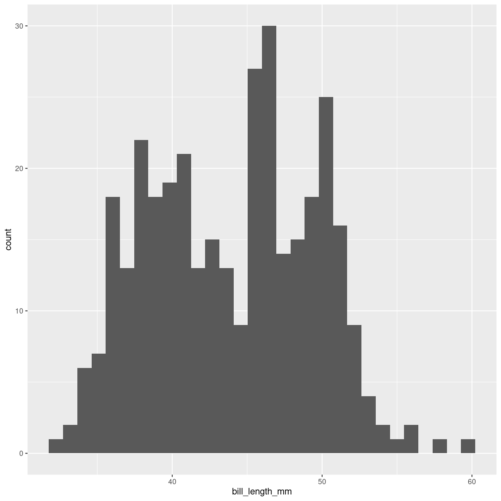
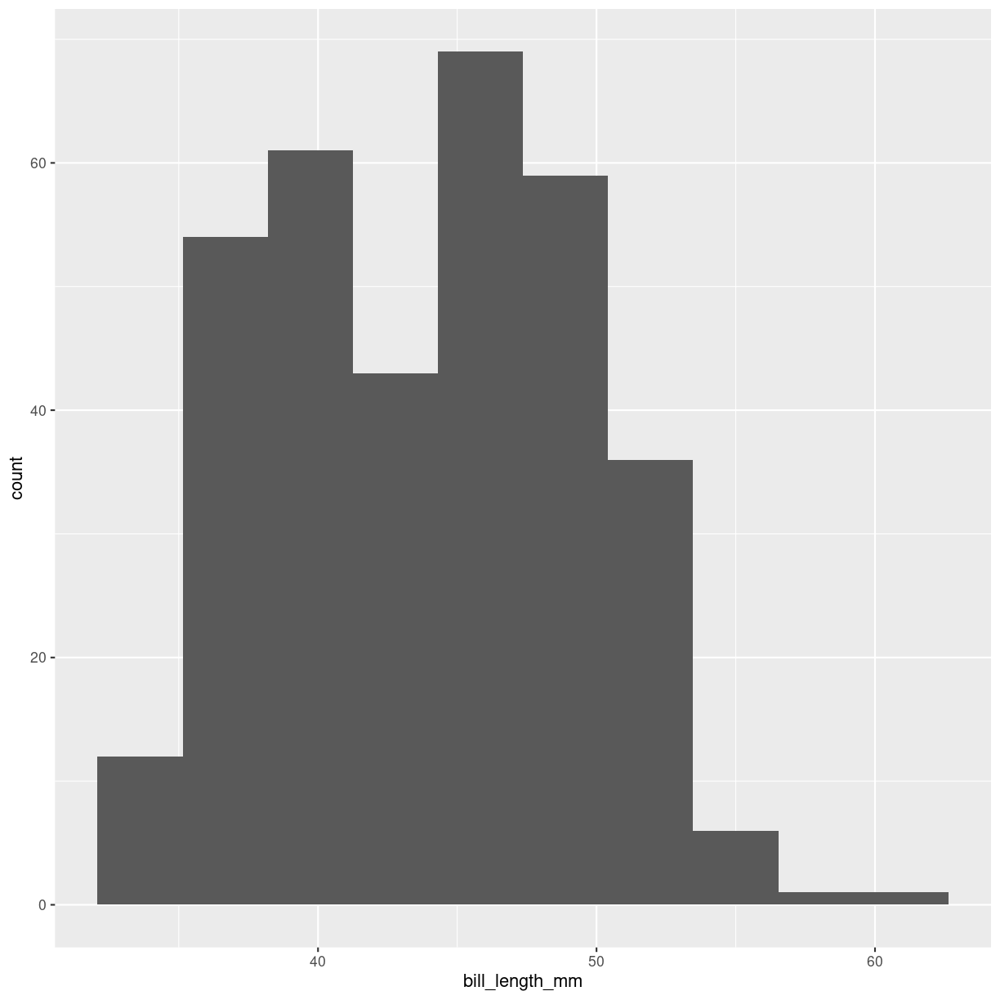
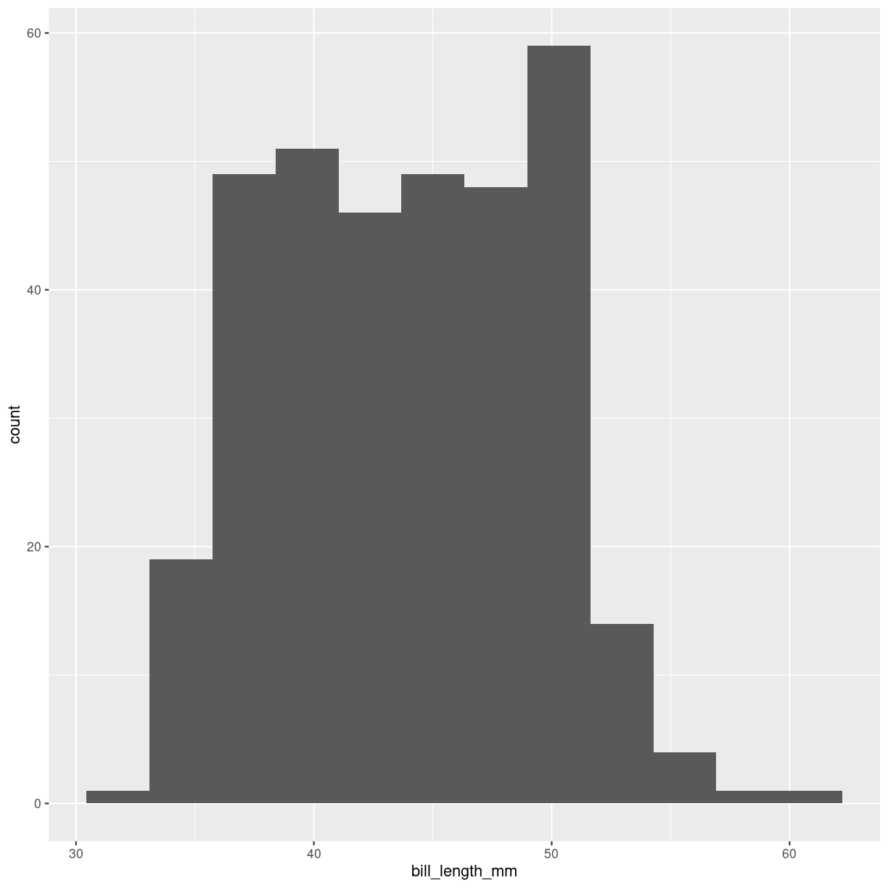

---
# Please do not edit this file directly; it is auto generated.
# Instead, please edit 12-histogrammer.md in _episodes_rmd/
title: "Histogrammer"
teaching: 0
exercises: 0
questions: 
  - "FIXME"
objectives:
  - "FIXME"
keypoints:
  - "FIXME"
source: Rmd
math: yes
---
  

## Hvad er et histogram?

Vi har nogen bins, tænk på dem som spande, der skal indeholde de
observationer i vores datasæt der ligger inden for et bestemt interval.

De er valgt sådan at alle vores data vil passe i en og kun en af disse bins. 

Nu fordeler vi så vores data i disse bins. Så tæller vi hvor mange 
observationer der er i hver af de her bins. Og plotter dem på denne måde:

~~~
ggplot(penguins, aes(x=bill_length_mm)) +
  geom_histogram()
~~~
{: .language-r}

~~~
`stat_bin()` using `bins = 30`. Pick better value with `binwidth`.
~~~
{: .output}

~~~
Warning: Removed 2 rows containing non-finite values (`stat_bin()`).
~~~
{: .warning}

Der er her 30 bins. Vores data, næblængden på nogle pingviner, 
falder i intervallet 32.1 til 59.6 millimeter. Hver bin er derfor
0.9167 millimeter bred. 

Hvad fortæller det os? Det fortæller os noget om hvordan fordelingen
af næblængder ser ud. Der er oftest sådan at der er flest i midten, 
færre der er kortere eller længere, og enkelte der er meget kortere eller
meget længere. Her ser det ud til at der er to af den slags fordelinger, som overlapper. Det er ikke så overraskende, dels er der forskellige 
pingvinarter i datasættet, dels er hanpingviners næb i gennemsnit længere end hunpingviners.

## Hvor mange bins?
Når vi plotter histogrammer - især med ggplot, får vi en advarsel.

Som default fordeler `geom_histogram()` nemlig data i 30 bins. Det gør
den fordi 30 bins næsten aldrig er det rigtige antal, og forfatterne af
funktion har bevidst valgt noget der næsten aldrig vil være rigtigt, for
at tvinge os til at vælge noget der er bedre.

Så man bør forholde sig til hvor mange bins der skal være. 
Hvordan gør man det?

## En funktion der gør det for os

Pakken `healthyR` er skrevet til at arbejde med hospitalsdata. Men
har også funktionen `opt_bin` der kan bruges til at finde de optimale
cuts i data til brug for et histogram - for en passende værdi af
optimal:

~~~
library(healthyR)
~~~
{: .language-r}

~~~

== Welcome to healthyR ===========================================================================
If you find this package useful, please leave a star: 
   https://github.com/spsanderson/healthyR'

If you encounter a bug or want to request an enhancement please file an issue at:
   https://github.com/spsanderson/healthyR/issues

Thank you for using healthyR
~~~
{: .output}

~~~
penguins %>% 
  filter(!is.na(bill_length_mm)) %>% 
opt_bin( bill_length_mm)
~~~
{: .language-r}

~~~
# A tibble: 18 × 1
   value
   <dbl>
 1  32.1
 2  33.7
 3  35.3
 4  37.0
 5  38.6
 6  40.2
 7  41.8
 8  43.4
 9  45.0
10  46.7
11  48.3
12  49.9
13  51.5
14  53.1
15  54.7
16  56.4
17  58.0
18  59.6
~~~
{: .output}
Som det fremgår er man nødt til at fjerne NA-værdier selv, funktionen
har ikke et na.rm argument. Og det vi får ud, er ikke antallet af bins,
men de breaks der skal være i data for at vi får de 18 bins som 
funktionen siger at vi skal have.

## Det er fint, hvordan gør man det generelt?

Der er to måder. 

1. Man bruger en heuristik til at gøre det. Det er det vi gjorde med funktionen ovenfor.

2. Man prøver forskellige antal bins, indtil man finder det antal, der bedst illustrerer 
det fænomen i data man ønsker at afdække.

> ## Heurestik
>
> Vi kalder det en heuristik, fordi det lyder fancy og som om
> vi er meget kloge, og ved hvad vi taler om.
> På almindeligt dansk er det bare en tommelfingerregel.
>
{: .testimonial}

### Shimazaki og Shinomoto

Den tommelfingerregel ovenstående funktion bruger er beskrevet 
her: https://www.neuralengine.org/res/histogram.html og stammer fra
Shimazaki and Shinomoto. Neural Comput, 2007, 19(6), 1503-1527

Man gør følgende, og bemærk at vi her bruger samme notation som i 
Shimazaki og Shinomotos beskrivelse.

Del datarange op i N bins med bredden $\Delta$. Tæl antallet af observationer
i hver bin. Det kalder vi $k_i$, hvor i angiver hvilken bin det er.

Beregn gennemsnittet k og variansen v af observationer i hver bin:

$k = 1/n \sum_{i=1}^{N} k_i$

$v = 1/N \sum_{i=1}^N(k_i - k)^2$

Beregn nu $C(\Delta)$
$C(\Delta) = 2k - v/\Delta^2$

Juster på $\Delta$ til $C(\Delta)$ er minimeret.

Eller udnyt at $\Delta$ er defineret som `range` af data (altså afstanden fra største til mindste datapunkt), divideret med antallet
af bins, N. Så kan vi nemlig justere på N i stedet, og det er en
del hurtigere. I praksis bruger vi bare funktionen `opt_bin` 

Det er fristende at beregne variansen af observationer i stedet for
v som ovenfor, men det mener Shimazaki og Shinomoto at man 
skal lave være med.

## Andre måder

Der er andre tommelfingerregler at følge.

I det følgende er der tre betegnelser vi bruger igen og igen.

Antallet af bins kalder vi `k`. I ovenstående graf er k defaultværdien
30. 

Bredden af bins kalder vi `h`. Den finder vi ved at tage den mindste 
værdi i datasættet, trække den fra den største værdi i datasættet (det
er datasættes range), og dividere med antallet af bins.

Antallet af observationer kalder vi `n`.

Og så er der nogle mærkelige paranteslignende tegn: $\lceil$ og $\rceil$.
Det er en såkaldt ceiling funktion. Den betyder blot, at når vi skal runde tallene op. 

Bemærk at vi skal ikke runde *af* . Vi skal runde *op*: 4.01 skal rundes op til 5. Funktionen `ceiling()` hjælper os med det.

### Freedman-Diaconis 

Bredden af bins skal sættes til 

$h = 2*IQR*n^{-1/3}$

`IQR` får vi direkte fra funktionen `IQR()`

### Kvadratrodsreglen

Antallet af bins findes på denne måde: 

$k = \lceil\sqrt{n}\rceil$

### Sturges-reglen

$k = \lceil\log_2(n) + 1\rceil$

Bemærk at det implicit antages at data er ca. normalfordelte.

### Rice reglen

$k = \lceil2*n^{-1/3}\rceil$

### Doanes formel

$k= 1 + \log_2(n) + \log_2(1+ |g_1|/\sigma_{g1})$ 

hvor

$g_1$ er den estimerede 3. moments skewness af fordelingen, og 

$\sigma_{g1} = \sqrt{6(n-2)/((n+1)*(n+3))}$

Den er en modifikation af Sturges, der forsøger at give bedre resultater
når data ikke er normalfordelte.

Skewness kan vi beregne ved hjælp af en funktion vi får fra pakken
`moments`:

~~~
library(moments)
skewness(penguins$bill_length_mm, na.rm = T)
~~~
{: .language-r}

~~~
[1] 0.05288481
~~~
{: .output}

### Scott's regel 

Finder bredden h ved: 

$h = 3.49 \frac{\sigma}{n^{-1/3}}$, 

hvor sigma er standardafvigelsen af stikprøven.

## Hvordan i praksis?

Vi kan nærlæse hjælpen til `hist()` funktionen indbygget i R. Den fortæller
at hist som default beregner breaks efter "Sturges" algoritmen.

Det kan vi udnytte til at få breaks, her efter Freedman-Diaconis
reglen:

~~~
k <- hist(penguins$bill_length_mm, breaks = "FD", plot = FALSE)
k$breaks
~~~
{: .language-r}

~~~
 [1] 32 34 36 38 40 42 44 46 48 50 52 54 56 58 60
~~~
{: .output}

Med default, som altså er "Sturges":

~~~
k <- hist(penguins$bill_length_mm, plot = FALSE)
~~~
{: .language-r}

eller efter Scott algoritmen:

~~~
k <- hist(penguins$bill_length_mm, breaks = "scott", plot = FALSE)
~~~
{: .language-r}

Hjælpeteksten antyder også at der er funktioner til at beregne
antallet af klasser, bins, direkte. 

Scott:

~~~
penguins %>% 
  filter(!is.na(bill_length_mm)) %>% 
  pull(bill_length_mm) %>% 
  nclass.scott()
~~~
{: .language-r}

~~~
[1] 11
~~~
{: .output}

Freedman-Diaconis:

~~~
penguins %>% 
  filter(!is.na(bill_length_mm)) %>% 
  pull(bill_length_mm) %>% 
  nclass.FD()
~~~
{: .language-r}

~~~
[1] 11
~~~
{: .output}

Sturges:

~~~
penguins %>% 
  filter(!is.na(bill_length_mm)) %>% 
  pull(bill_length_mm) %>% 
  nclass.Sturges()
~~~
{: .language-r}

~~~
[1] 10
~~~
{: .output}

Ellers må man beregne det selv.

## Hvad med ggplot?

`geom_histogram` i ggplot2 understøtter ikke at man kan angive hvilken
metode man ønsker at bruge til at beregne breaks i ens data. Så
der må man gøre det selv, eksempelvis med Sturges:

~~~
bins <- ceiling(log2(length(penguins$bill_length_mm))) + 1
penguins %>% 
  ggplot(aes(x = bill_length_mm)) +
  geom_histogram(bins = bins)
~~~
{: .language-r}

~~~
Warning: Removed 2 rows containing non-finite values (`stat_bin()`).
~~~
{: .warning}

Bruger man i stedet en metode der giver os bredden af bins, 
binwidth, gøres det på denne måde:

~~~
binwidth <- 2*IQR(penguins$bill_length_mm, na.rm = T)*length(penguins$bill_length_mm)^(-1/3)

penguins %>% 
  ggplot(aes(x = bill_length_mm)) +
  geom_histogram(binwidth = binwidth)
~~~
{: .language-r}

~~~
Warning: Removed 2 rows containing non-finite values (`stat_bin()`).
~~~
{: .warning}

## Hvilken skal man så vælge?

Man skal vælge det antal bins, eller den bredde af bins, der 
viser hvad man gerne vil have frem i sit histogram. 

Når man så har fundet ud af at 11 bins er det bedste antal, så 
finder man den tommelfingerregel af de ovenstående, der giver tallet
11, og forklarer at antallet af bins er valgt efter den regel.

