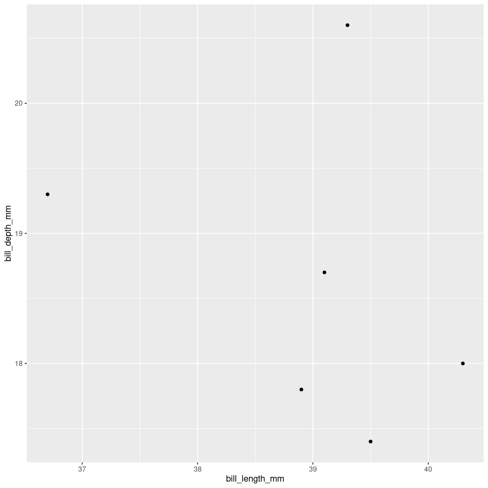
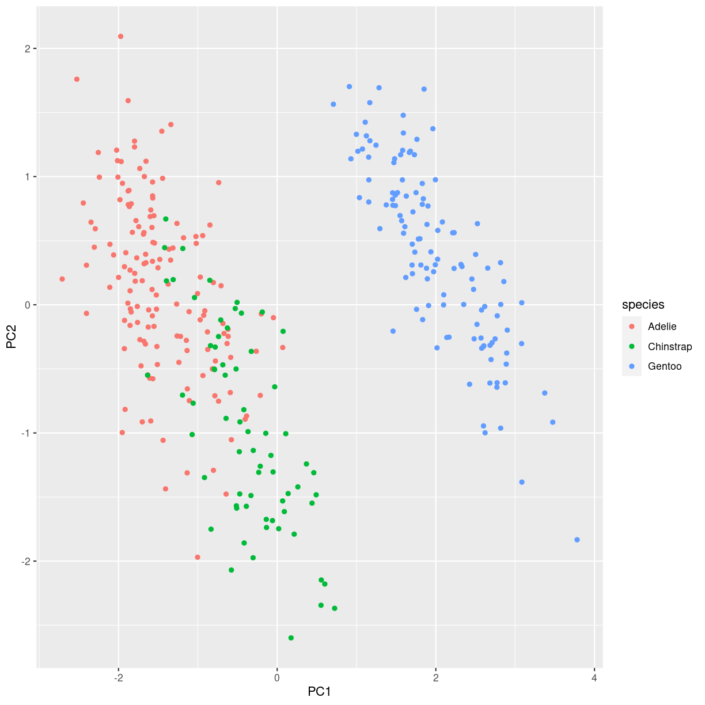
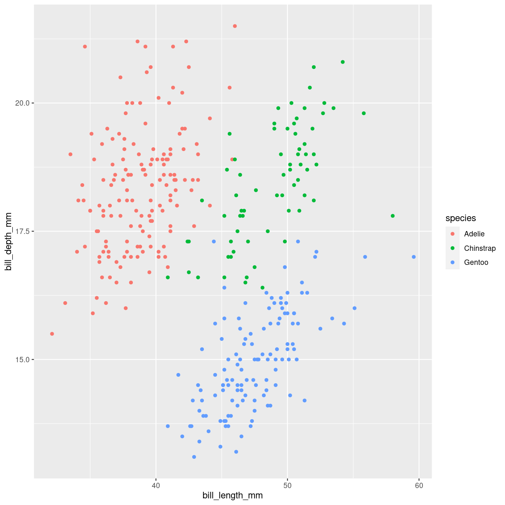

---
# Please do not edit this file directly; it is auto generated.
# Instead, please edit 14-pca.md in _episodes_rmd/
title: "Principal Component Analyse (PCA)"
teaching: 0
exercises: 0
questions: 
- "FIXME"

objectives:
- "FIXME"

keypoints:
- "FIXME"
source: Rmd
math: yes
---

# Principal Component Analyse

En dimensionsreducerende maskinlæringsalgoritme.

Vi har noget data i en tabel:

~~~
penguins %>% na.omit() %>% select(bill_length_mm, bill_depth_mm) %>% head()
~~~
{: .language-r}

~~~
# A tibble: 6 × 2
  bill_length_mm bill_depth_mm
           <dbl>         <dbl>
1           39.1          18.7
2           39.5          17.4
3           40.3          18  
4           36.7          19.3
5           39.3          20.6
6           38.9          17.8
~~~
{: .output}
Det er data om pingviners næb. Der er to dimensioner, og vi kan plotte dem:

plot of chunk to-dim-pingvin-plot

Faktisk er der mere end to dimensioner:

~~~
# A tibble: 6 × 8
  species island    bill_length_mm bill_depth_mm flipper_length_mm body_mass_g
  <fct>   <fct>              <dbl>         <dbl>             <int>       <int>
1 Adelie  Torgersen           39.1          18.7               181        3750
2 Adelie  Torgersen           39.5          17.4               186        3800
3 Adelie  Torgersen           40.3          18                 195        3250
4 Adelie  Torgersen           36.7          19.3               193        3450
5 Adelie  Torgersen           39.3          20.6               190        3650
6 Adelie  Torgersen           38.9          17.8               181        3625
# ℹ 2 more variables: sex <fct>, year <int>
~~~
{: .output}

Vi ved også hvor meget de vejer, hvor lange deres ? vinger? er, deres køn,
hvornår de er blevet målt, hvilken ø de var på, og deres art.

Hvis vi nøjes med de talværdier der er andet end et årstal, har vi fire dimensioner.

Det kan vi ikke plotte. Vi er nødt til at reducere antallet af dimensioner for 
at få noget visuelt. 

Det snedige er at vi kan ændre på dimensionerne, så længe vi overholder visse
matematiske spilleregler. I stedet for en dimension der 
er defineret som "længden af næbbet", kan vi eksempelvis definere en dimension 
der er "0.7 gange længden af næbbet, plus 0.047 ganget med vægten af pingvinen". 

Det der er det *rigtig* snedige er, at hvis vi vælger den rigtige måde at lave de
her nye dimensioner, så kan vi få vist strukturer i data, som vi ellers ikke 
kan se.

Det er kernen i Principal Componen Analysen. Den konstruerer nye dimensioner.
Som udgangspunkt laver den lige så mange som der var før. Men de nye dimensioner
er konstrueret, så den første forklarer mest muligt af variationen i data.
Den anden nye dimension forklarer mest muligt af den variation der er tilbage i
data efter den første har været der. Og så videre. 

Vi rydder lidt op først:

~~~
# A tibble: 6 × 5
  species bill_length_mm bill_depth_mm flipper_length_mm body_mass_g
  <fct>            <dbl>         <dbl>             <int>       <int>
1 Adelie            39.1          18.7               181        3750
2 Adelie            39.5          17.4               186        3800
3 Adelie            40.3          18                 195        3250
4 Adelie            36.7          19.3               193        3450
5 Adelie            39.3          20.6               190        3650
6 Adelie            38.9          17.8               181        3625
~~~
{: .output}

så trækker vi oplysninger om pingvin arten ud til senere brug:

~~~
[1] Adelie Adelie Adelie Adelie Adelie Adelie
Levels: Adelie Chinstrap Gentoo
~~~
{: .output}

Og kører PCA på den. Det sker med funktionen `prcomp`:

Og så kan vi plotte det. Vi får en del med i modellen, men lad os starte
med at se på de principiale komponenter. De ligger i pca_penguins$x.
Vi tilføjer oplysninger om pingvin-arten, og farvelægger efter netop den:

~~~
pca_penguins$x %>% 
  as_tibble() %>% 
  mutate(species = species_penguins) %>% 
  ggplot(aes(PC1, PC2, color = species)) + 
  geom_point()
~~~
{: .language-r}

plot of chunk pca-plot

Vi kan sammenligne med et plot af dimensionerne på deres næb:

~~~
penguins %>% 
  ggplot(aes(bill_length_mm, bill_depth_mm, color = species)) +
  geom_point()
~~~
{: .language-r}

~~~
Warning: Removed 2 rows containing missing values (`geom_point()`).
~~~
{: .warning}

plot of chunk unnamed-chunk-3

Når vi sammenligner, kan vi se at Æselpingvinerne (Gentoo) er pænt
adskilt fra de to andre pingvinarter i plottet.

Det kan vi så bruge. Vej pingvinerne, mål deres næb og deres vinger. Og du
kan afgøre om de er en æselpingvin. 

Ja, det er nok lettere at kigge på pingvinen, og se om den ligner en 
æselpingvin eller ej.

## Hvad ligger der ellers i modellen?

PCA-modellen for pingvinerne hedder pca_penguins. 

Den indeholder flere ting. I x ligger de nye værdier for alle 
pingvinerne i de nye dimensioner, kaldet Principiale Komponenter:

~~~
pca_penguins$x %>% head()
~~~
{: .language-r}

~~~
           PC1         PC2         PC3        PC4
[1,] -1.850808 -0.03202119  0.23454869  0.5276026
[2,] -1.314276  0.44286031  0.02742880  0.4011230
[3,] -1.374537  0.16098821 -0.18940423 -0.5278675
[4,] -1.882455  0.01233268  0.62792772 -0.4721826
[5,] -1.917096 -0.81636958  0.69999797 -0.1961213
[6,] -1.770356  0.36567266 -0.02841769  0.5046092
~~~
{: .output}

Hvad havde den første pingvin af data?

~~~
data_penguins %>% slice(1)
~~~
{: .language-r}

~~~
# A tibble: 1 × 4
  bill_length_mm bill_depth_mm flipper_length_mm body_mass_g
           <dbl>         <dbl>             <int>       <int>
1           39.1          18.7               181        3750
~~~
{: .output}

Og hvor blev den placeret i de nye koordinater?

~~~
pca_penguins$x[1,]
~~~
{: .language-r}

~~~
        PC1         PC2         PC3         PC4 
-1.85080775 -0.03202119  0.23454869  0.52760264 
~~~
{: .output}
Hvordan fandt vi dem?

~~~
pca_penguins$rotation
~~~
{: .language-r}

~~~
                         PC1         PC2        PC3        PC4
bill_length_mm     0.4537532 -0.60019490 -0.6424951  0.1451695
bill_depth_mm     -0.3990472 -0.79616951  0.4258004 -0.1599044
flipper_length_mm  0.5768250 -0.00578817  0.2360952 -0.7819837
body_mass_g        0.5496747 -0.07646366  0.5917374  0.5846861
~~~
{: .output}

~~~
(43.99279-39.1)* 0.4537532 - (17.16486-18.7)*0.3990472 + (200.96697-181)*0.5768250+ (4207.05706-3750)*0.5496747
~~~
{: .language-r}

~~~
[1] 265.5829
~~~
{: .output}

~~~
pca_penguins$
~~~
{: .language-r}

~~~
Error: <text>:2:0: unexpected end of input
1: pca_penguins$
   ^
~~~
{: .error}

