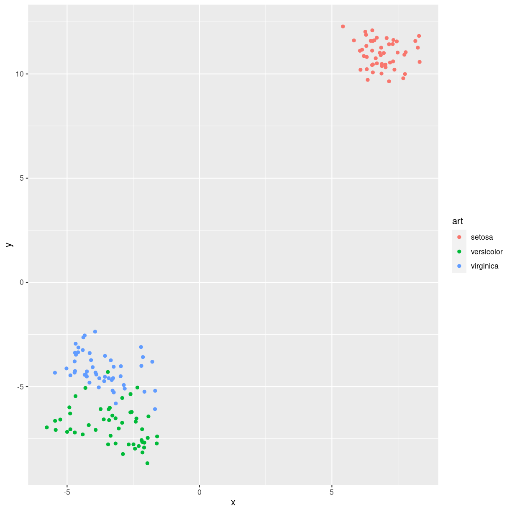

---
# Please do not edit this file directly; it is auto generated.
# Instead, please edit 15-t-sne.md in _episodes_rmd/
title: "t-sne"
teaching: 0
exercises: 0
questions: 
- "FIXME"

objectives:
- "FIXME"

keypoints:
- "FIXME"
source: Rmd
math: yes
---

T-SNE (t-distributed Stochastic Neighbor Embedding) er en maskinlæringsalgoritme, 
der hjælper med at visualisere højdimensionale data i et lavere dimensionalt rum, 
som oftest 2D eller 3D. Den gør det ved at finde mønstre og sammenhænge i de 
komplekse data og gengive dem i en mere forståelig og håndterbar form. Det 
hjælper os med at identificere og analysere strukturer, grupperinger og 
tendenser i dataene, som kan være svære at se i det originale højdimensionale rum.

Eller, kortere formuleret, vi har data i mange (som i flere end 2-3 stykker)
dimensioner. Vi ser på iris datasættet:

~~~
  Sepal.Length Sepal.Width Petal.Length Petal.Width Species
1          5.1         3.5          1.4         0.2  setosa
2          4.9         3.0          1.4         0.2  setosa
3          4.7         3.2          1.3         0.2  setosa
4          4.6         3.1          1.5         0.2  setosa
5          5.0         3.6          1.4         0.2  setosa
6          5.4         3.9          1.7         0.4  setosa
~~~
{: .output}
Dette datasæt har fire dimensioner. Det er vanskeligt at vise grafisk. 

Disse mange dimensioner vil vi godt have kogt ned til 2, max 3, for vi kan 
ikke vise 4 dimensioner på en skærm. Det går heller ikke så godt med 3.

~~~
Rtsne()
~~~
{: .language-r}

~~~
Error in Rtsne(): could not find function "Rtsne"
~~~
{: .error}

hvad med blomsterne?

~~~
library(Rtsne)
library(plotly)
~~~
{: .language-r}

~~~

Attaching package: 'plotly'
~~~
{: .output}

~~~
The following object is masked from 'package:ggplot2':

    last_plot
~~~
{: .output}

~~~
The following object is masked from 'package:stats':

    filter
~~~
{: .output}

~~~
The following object is masked from 'package:graphics':

    layout
~~~
{: .output}

~~~
iris_unik <- unique(iris)
iris_art <- iris_unik %>% pull(Species)
iris_matrix <- as.matrix(iris_unik[,1:4])

iris_tsne <- Rtsne(iris_matrix, dims = 3)

iris_data <- tibble(x = iris_tsne$Y[,1], y = iris_tsne$Y[,2], z = iris_tsne$Y[,3], art = iris_art)
p <- plot_ly(iris_data, x = ~x, y = ~y, z = ~z, color = ~art)
add_markers(p, color = ~art )
~~~
{: .language-r}

plot of chunk unnamed-chunk-3

~~~
p
~~~
{: .language-r}

~~~
No trace type specified:
  Based on info supplied, a 'scatter3d' trace seems appropriate.
  Read more about this trace type -> https://plotly.com/r/reference/#scatter3d
~~~
{: .output}

~~~
No scatter3d mode specifed:
  Setting the mode to markers
  Read more about this attribute -> https://plotly.com/r/reference/#scatter-mode
~~~
{: .output}

plot of chunk unnamed-chunk-3

~~~
iris_data %>% ggplot(aes(x,y, color = art)) +
  geom_point()
~~~
{: .language-r}

plot of chunk unnamed-chunk-3

